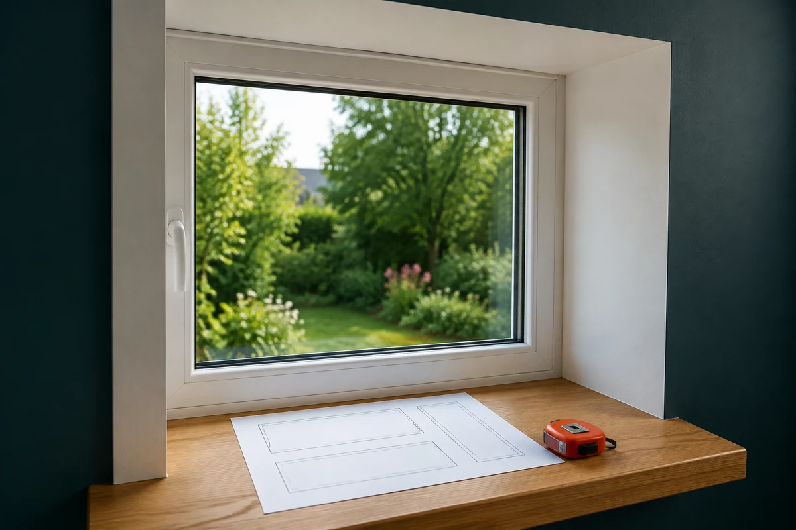
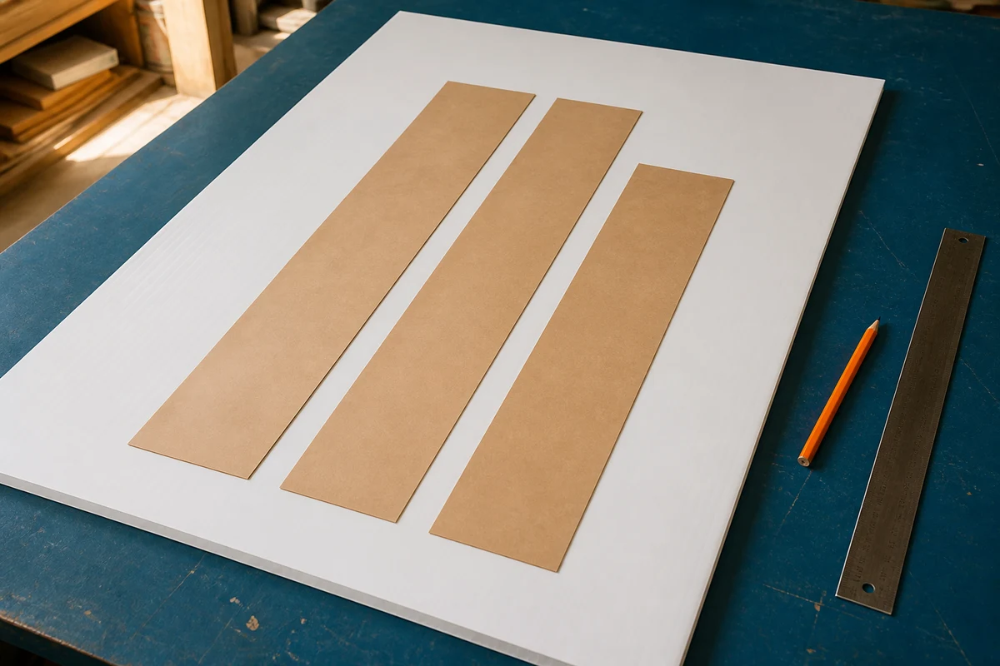

**ПВХ-панели на оконный откос нельзя надёжно посчитать только по общей площади.** У каждого окна есть две боковые грани и верхняя; для них нужны детали разной длины. Сначала снимают размеры трёх поверхностей, затем раскладывают их на габарите именно выбранной панели и только после этого считают целые листы или готовые нарезки.

Это особенно важно, когда окно высокое, откос глубокий или панель покупается целым листом. Площадь может выглядеть небольшой, но два длинных боковых элемента не поместятся в оставшуюся полосу. Обратная ситуация тоже встречается: обрезок от боковины пригодится на верхнюю деталь, и запас по площади окажется лишним.

## Сначала выясните, какой материал лежит в корзине

Под словом «ПВХ-панель» часто имеют в виду разные материалы. Узкая пустотелая стеновая панель и листовая панель для откосов считаются по-разному: в первом случае важны ширина каждой полосы и предусмотренный стык, во втором — размещение деталей на листе. Если откос шире одной полосы, заранее проверьте по документации выбранной системы, допустим ли стык и чем он оформляется.

Сэндвич-панель для откосов — другой материал: это листовая многослойная плита, а не узкая стеновая полоса. Например, [производитель ТБФ Пласт](https://www.tbf-plast.ru/?page_id=49) приводит для отдельных откосных сэндвич-панелей габариты 3000 × 1500 мм, но это не повод считать такой формат универсальным: в продаже бывают и другие длины, ширины и толщины. Сверяйте именно карточку или паспорт выбранного артикула, включая сторону с лицевым покрытием.

В этой статье слово «панель» дальше означает листовой материал, из которого можно вырезать прямоугольные детали. Если выбрана пустотелая узкая панель, сначала проверьте, можно ли закрыть глубину откоса одной её рабочей шириной и как будет устроен стык. Если система предусматривает стартовый, финишный или угловой профиль, его не следует молча прибавлять к площади панелей: это отдельная позиция и отдельный линейный обмер.

## Какие три размера снять с одного окна

Измерять нужно после установки оконного блока, от линии примыкания к раме до плоскости готовой стены. Полная толщина стены для этого не подставляется автоматически: часть её может не относиться к отделываемой грани.

Для каждого окна запишите высоту левого и правого откоса, ширину верхнего и глубину каждой из трёх граней. В прямоугольном проёме высоты боковин часто одинаковы, но глубины слева, справа и сверху могут отличаться. Проверьте глубину не в одной точке, а хотя бы у двух краёв грани. Если она меняется, не маскируйте это одним случайным числом: разбейте поверхность на простые фигуры или обсудите выравнивание с исполнителем.

| Деталь | Что измерить | Размер заготовки для карты резов |
|---|---|---|
| Левый откос | высоту и фактическую глубину | высота × глубина слева |
| Правый откос | высоту и фактическую глубину | высота × глубина справа |
| Верхний откос | ширину проёма и фактическую глубину | ширина × глубина сверху |

Не вычитайте из этих размеров «на глаз» место под профиль, заход в паз или зазор. Окончательные размеры чистовых деталей зависят от выбранной системы и её инструкции. Для предварительной закупки полезнее сначала получить честные габариты граней, а затем отметить на эскизе только те технологические припуски, которые прямо предусмотрены документацией конкретного изделия.

*На схеме фиксируют три отдельные детали, а не только площадь окна. Иллюстрация создана с помощью ИИ; она объясняет принцип обмера и не задаёт монтажных размеров.*

## Сначала карта резов, затем площадь

Пусть все числа ниже условные. Окно имеет ширину 1 240 мм, высоту 1 380 мм; глубины левой, правой и верхней граней — 260, 280 и 250 мм. Тогда нужны три заготовки: 1380 × 260, 1380 × 280 и 1240 × 250 мм. Их общая площадь равна 1,0552 м²: 1,380 × 0,260 + 1,380 × 0,280 + 1,240 × 0,250.

Теперь допустим, что паспортный габарит выбранного листа — 3000 × 1500 мм. На нём сначала нарисуйте все три прямоугольника в одном масштабе, повернув каждый только так, как допускает материал и видимая сторона. В этом примере три детали располагаются параллельно длинной стороне листа: размеры 1380, 1380 и 1240 мм идут вдоль 3000 мм, а их ширины 260 + 280 + 250 дают 790 мм поперёк листа. Между полосами оставляют место под пропил; 1500 мм ширины листа для такой схемы достаточно. Это учебная проверка размещения, а не инструкция о том, как резать любой конкретный продукт.

Важен не только итог «1,0552 м² меньше 4,5 м² листа». Длинная сторона заготовки должна поместиться в соответствующую сторону листа, а остаток — быть достаточно широким и длинным для следующей детали. Отрезанная полоса шириной 90 мм может иметь заметную площадь, но не пригодиться ни для одной из трёх граней. Деталь с дефектом видимой поверхности или кромки не закладывают в чистовую лицевую часть без отдельной оценки того, будет ли дефект закрыт системой.

*Перед покупкой детали раскладывают на габарите выбранного листа. Иллюстрация создана с помощью ИИ; это условная визуализация, а не карта раскроя для конкретного артикула.*

## Как считать целые панели и не добавить запас дважды

После карты резов видно, сколько листов действительно потребуется. Если один лист закрывает три детали одного окна, к покупке идёт один лист, даже когда точная площадь меньше его площади в несколько раз. Если деталей несколько окон, сначала попробуйте разместить заготовки всех окон на листах: одинаковые боковины иногда разумно вырезать серией, но остатки нужно проверять по реальным размерам, а не по суммарным квадратным метрам.

В [калькуляторе откосов](/kalkulyatory/otdelka/otkosy-okon-i-dverej/) можно получить площадь трёх прямоугольных граней: высота × (глубина слева + глубина справа) + ширина × глубина сверху. В режиме листового материала сервис делит площадь с выбранным явным запасом на введённую полезную площадь единицы и округляет результат вверх до целого. Он не знает размеров отдельных заготовок, направления рисунка, стыков и пригодности обрезков. Поэтому используйте его как проверку площади и закупочной кратности, а решение о числе листов подтверждайте своей картой резов.

Запас выбирают не «по умолчанию», а после эскиза. Если на карте остаются пригодные широкие остатки и все детали помещаются без узких полос, дополнительный запас может не понадобиться. Если есть риск брака при резе, одна деталь близка к предельному размеру листа или обрезки некуда применить, причина для дополнительной единицы должна быть видна в раскладке. Не прибавляйте процент к площади, а потом ещё раз покупайте лишний лист «на всякий случай» — это два разных решения, которые легко задвоить.

Панели, профили, крепёж, пена, герметики и утепление не образуют универсальный комплект. Эта статья не проверяет монтажный шов, влажностный режим и теплотехнику узла. Для них нужна документация выбранной системы и, при проблемном или наружном откосе, проектное решение.

Хороший расчёт заканчивается не цифрой квадратных метров, а тремя подписанными заготовками на габарите конкретной панели. С таким эскизом проще сверить заказ, обсудить раскрой с мастером и увидеть лишний лист до оплаты, а не после первого реза.
