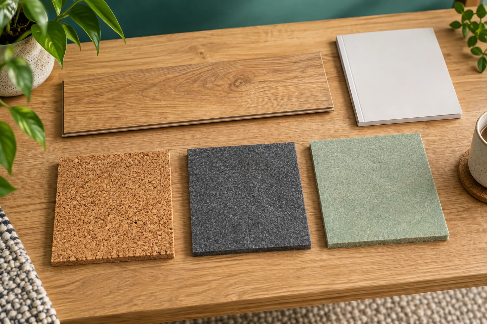
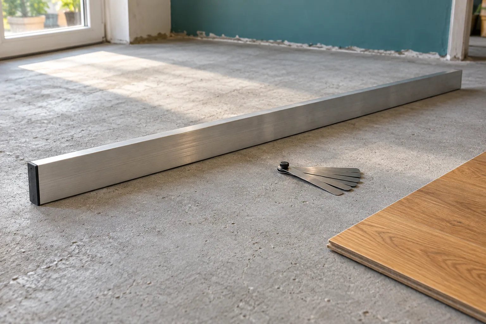

**Подложку под ламинат выбирают по требованиям конкретного покрытия и состоянию основания, а не только по толщине.** Сначала выясните, какой материал допускает изготовитель доски, затем проверьте влагозащиту и совместимость с отоплением. И только после этого сравнивайте цену рулона или пачки.

Представьте: ламинат уже выбран, цвет подходит к дверям, а продавец предлагает подложку «потолще, чтобы было мягче». Звучит убедительно. Но мягкость образца в руке ещё не отвечает на главный вопрос: как будет работать собранный пол. Покупать подложку лучше с названием коллекции ламината и её инструкцией, а не просто со списком квадратных метров.

## С чего начать выбор

Откройте инструкцию именно к вашей коллекции. Уточните назначение покрытия: рекомендации для ламината нельзя автоматически переносить на SPC, винил или паркетную доску. Даже в одном каталоге аксессуаров могут соседствовать продукты для разных полов.

Найдите раздел о подложке и сопоставьте его с техническим листом выбранного материала. Нужны не рекламные слова «премиум» и «усиленная», а совместимость, допустимая толщина и характеристики, которые требует изготовитель покрытия. Если на ценнике их нет, попросите документ у продавца. Quick-Step, например, отдельно подчёркивает, что его подложки испытаны вместе с напольными покрытиями марки. Это аргумент проверять сочетание материалов, а не выбирать аксессуар вслепую. [Рекомендации Quick-Step по выбору](https://www.quick-step.ru/faq/laminat/podgotovka-i-ukladka/podlozhka-dlya-laminata-kak-vybrat-/).

## Какая толщина подложки лучше: 2, 3 или 5 мм

Сам по себе миллиметраж не определяет качество. В техническом бюллетене EPLF отдельно разбираются сопротивление сжатию, поведение под длительной и повторной нагрузкой, акустика и тепловое сопротивление. Толщина или плотность не заменяют эти характеристики. Поэтому две подложки одинаковой толщины не стоит считать взаимозаменяемыми. [Бюллетень EPLF о подложках, редакция 12/2022](https://eplf.com/storage/files/eplf-tb-underlay-materials-final-122022-v2_1.pdf).

У EGGER в FAQ также есть предупреждение: слишком толстая и недостаточно устойчивая к давлению подложка может ухудшать работу замковых соединений. Это не означает, что любой толстый материал плох. Это означает, что решение «возьму потолще на всякий случай» не годится без проверки допуска к конкретному полу. [FAQ EGGER, раздел Underlay materials](https://www.egger.com/en/flooring/service-and-information/faqs?country=AM).

*Иллюстрация создана с помощью ИИ. Образцы показаны отдельно: их внешний вид не подтверждает характеристики и совместимость.*

Пробка, вспененный материал, минеральная подложка или древесноволокнистая плита — ещё не готовый ответ на вопрос «что лучше». Сравнивать нужно конкретные изделия с документами. Если продавец предлагает замену рекомендованному продукту, попросите показать, по каким параметрам она подходит к выбранному покрытию.

## Можно ли подложкой выровнять пол

Подложка не должна превращаться в способ спрятать неподготовленное основание. EPLF различает небольшие локальные неровности и протяжённые перепады: последние нужно устранять подготовкой основания, а не рассчитывать, что их заполнит мягкий слой. В противном случае под покрытием могут остаться пустоты. [Раздел PC в бюллетене EPLF](https://eplf.com/storage/files/eplf-tb-underlay-materials-final-122022-v2_1.pdf).

До покупки проверьте пол правилом в нескольких направлениях и сравните результат с допусками инструкции. Не подставляйте сюда универсальное число из чужой статьи: важны и размер отклонения, и длина, на которой его измеряют. Если основание не проходит проверку, сначала решается эта задача, затем выбирается подложка.

*Иллюстрация создана с помощью ИИ. Проверка основания предшествует укладке; изображение не подтверждает ровность конкретного пола.*

## Бетон, деревянное основание и влагозащита

Подложка и влагозащитный слой выполняют разные задачи, хотя могут быть объединены в одном продукте. Например, в техническом листе Quick-Step Silent Walk указана встроенная пароизоляция и условия герметизации стыков. Не стоит считать, что такой же слой есть у любого рулона похожего цвета. [Технический лист Silent Walk](https://www.quick-step.co.uk/-/media/imported%20assets/flooring/2/7/0/qsacctdsqsudlsw7enpdf223529.ashx?filename=Technical+data+sheet+English.pdf&rev=634810ced4ef4266a7153e77cb09510b&type=original).

Для минерального и деревянного основания требования могут различаться. Так, EGGER предписывает влагозащитную плёнку на минеральном основании, но не допускает её на перечисленных в FAQ деревянных основаниях. Применяйте инструкцию своей системы пола: переносить решение со стяжки на OSB без проверки нельзя. [Требования EGGER к основанию и влагозащите](https://www.egger.com/en/flooring/service-and-information/faqs?country=AM).

Практический вопрос продавцу здесь звучит так: «В выбранной подложке уже есть нужная влагозащита или для моего основания потребуется отдельная плёнка?» Ответ должен включать способ соединения полотен, а не только слово «есть».

## Что проверить, если есть тёплый пол

Для отопления, расположенного под подложкой, важна теплопередача всей конструкции. В документации Quick-Step тепловое сопротивление покрытия и подложки рассматривается совместно; у отдельных подложек есть ограничения. Надпись «тёплая» на упаковке поэтому не равнозначна «подходит для тёплого пола». [Quick-Step: ламинат и напольное отопление](https://www.quick-step.co.uk/en-gb/frequently-asked-questions/laminate/general/can-i-use-quick-step-laminate-in-combination-with-underfloor-heating).

Уточняйте также, где расположен нагревательный элемент. Система в стяжке и плёнка непосредственно под покрытием — не одна и та же конструкция. EPLF рассматривает расположение нагрева над и под подложкой отдельно. Допуск должен быть у всего сочетания: покрытия, подложки и отопительной системы. [Схемы отопления в бюллетене EPLF](https://eplf.com/storage/files/eplf-tb-underlay-materials-final-122022-v2_1.pdf).

## Что искать на упаковке и в техническом листе

Эта таблица пригодится в магазине. Она не назначает «лучшую» подложку: помогает проверить, хватает ли данных для покупки.

| Что уточнить в инструкции к полу | Что проверить у подложки | Когда не покупать наугад |
|---|---|---|
| Какие подложки допускаются | Назначение и документ о характеристиках выбранного изделия | Продавец предлагает только сравнить толщину |
| Нужна ли влагозащита для вашего основания | Встроенный барьер либо отдельная плёнка, требования к стыкам | Про слой известно лишь «он блестящий» |
| Совместима ли конструкция с отоплением | Допуск и тепловые характеристики | Есть значок отопления, но нет технического листа |
| Есть ли у покрытия встроенная подложка | Нужен ли вообще отдельный материал | Второй слой предлагают «для надёжности» |
| Какие документы нужны перед монтажом | Инструкция, маркировка и артикул фактически купленного товара | Название в чеке не совпадает с выбранным изделием |

Если задача — уменьшить шум, уточните, какой именно. Звук шагов в самой комнате и ударный шум, передающийся ниже, — разные показатели. В документации Silent Walk они описаны отдельно. Сравнивайте одноимённые характеристики, а не число децибел на одной упаковке со «звёздами комфорта» на другой. [Акустические характеристики Silent Walk](https://www.quick-step.co.uk/-/media/imported%20assets/flooring/2/7/0/qsacctdsqsudlsw7enpdf223529.ashx?filename=Technical+data+sheet+English.pdf&rev=634810ced4ef4266a7153e77cb09510b&type=original).

## Сколько подложки покупать: рулоны или погонные метры

Когда материал выбран, остаётся перевести площадь в формат продажи. Не путайте погонный метр с квадратным: погонный метр — это длина полотна при его фактической ширине.

Возьмём условную комнату **20 м²** и отдельно заданное плановое добавление **5%**. Для примера потребность составит **21 м²**. Это исходное допущение примера и текущего калькулятора, а не обязательный запас для любой подложки.

Если материал продаётся целыми упаковками по **10 м²**, потребуется **3 упаковки**: покупка даст 30 м², то есть 9 м² сверх принятой потребности. Дробные «2,1 упаковки» помогают понять деление, но не являются количеством к покупке.

Если тот же расчёт выполняется для рулонной подложки **на отрез шириной 1,2 м**, длина по площади равна **21 ÷ 1,2 = 17,5 пог. м**. При шаге продажи 1 м покупают 18 пог. м — это 21,6 м² и остаток 0,6 м² сверх потребности. Если продавец отпускает по 0,1 м, можно заказать 17,5 пог. м.

Здесь есть важное ограничение: равенство площадей ещё не доказывает, что полосы удачно раскроятся. Проверьте их длину, расположение стыков и возможность использовать обрезки. Не принимайте учебный пример за готовую карту раскроя своей комнаты.

В [калькуляторе ламината](/kalkulyatory/poly/laminat/) можно выбрать целые упаковки или покупку рулонной подложки на отрез, указать ширину и шаг продажи. Он покажет количество к покупке и пояснение в квадратных метрах. Если нужны сами доски, начните со статьи [как рассчитать ламинат на комнату](/blog/kak-rasschitat-laminat-na-komnatu/), а рисунок укладки проверьте в [инструменте раскладки ламината](/instrumenty/raskladka-laminata/).

## Короткие ответы перед покупкой

### Можно ли уложить два слоя подложки?

Не добавляйте второй слой по собственной инициативе. Например, EGGER прямо не допускает многослойную укладку подложки для компенсации высоты. Разницу с соседним покрытием нужно решать способом, предусмотренным для вашей конструкции пола, а не наращивать мягкий пакет. [FAQ EGGER](https://www.egger.com/en/flooring/service-and-information/faqs?country=AM).

### Нужна ли подложка, если она уже приклеена к доске?

Сначала проверьте инструкцию покрытия. У EGGER для полов со встроенным слоем Silenzio дополнительная звукоизоляционная подложка запрещена. При этом вопрос влагозащиты основания рассматривается отдельно: встроенный акустический слой не отменяет такую проверку. [FAQ EGGER о встроенной подложке](https://www.egger.com/en/flooring/service-and-information/faqs?country=AM).

### Можно ли выбирать только по цене за рулон?

Лучше сравнивать стоимость покупки для своей комнаты. У двух рулонов могут различаться площадь, ширина и способ продажи. Более дешёвый рулон не обязательно даст более дешёвую смету, особенно если придётся покупать целую лишнюю упаковку. Но сначала проверьте совместимость: выгодная цена не делает неподходящий материал подходящим.

**Хороший итог выбора — не название «самой лучшей» подложки, а понятный комплект:** конкретный материал, подходящий к вашему покрытию и основанию, необходимые дополнительные слои по инструкции и количество, которое действительно можно купить.
