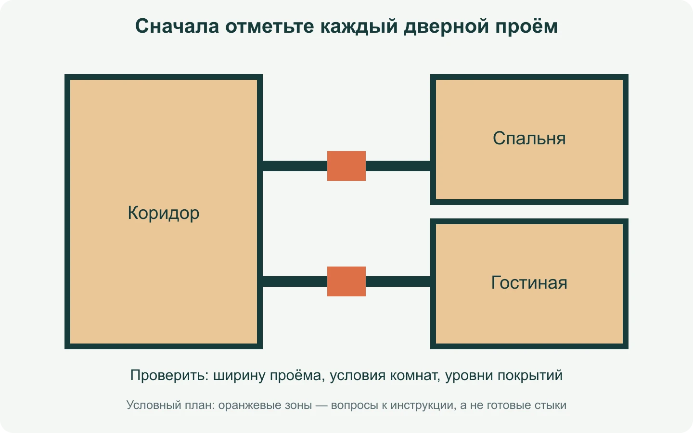
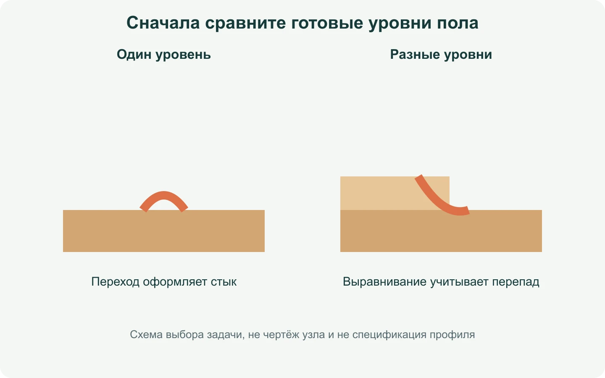
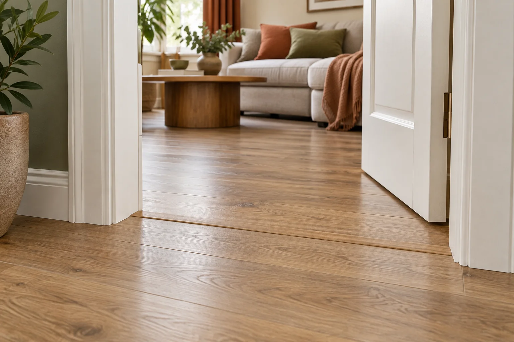

**Цельный ламинат между комнатами выглядит спокойно, но это не повод убирать каждый стык автоматически.** Сначала нужно понять требования именно вашей коллекции, ширину и условия дверного проёма, разницу уровней и способ оформления. Иногда решение без заметной накладки допустимо. Иногда аккуратный профиль — не компромисс, а нормальная часть правильного узла.

Ни одна фотография красивого пола не отвечает на вопрос «можно ли так у меня». У одинакового декора могут быть разные комнаты, отдельные зоны тёплого пола, узкие проёмы или другой замок. Эта статья помогает составить план для мастера и магазина, но не заменяет инструкцию конкретного производителя.

## Порог, профиль и компенсационный шов — разные вещи

В разговоре словом «порог» часто называют всё сразу: нижнюю часть дверной коробки, видимую накладку на полу и сам разрыв покрытия. На деле профиль закрывает или оформляет переход, а компенсационный шов оставляет покрытию место для движения. Убрать высокий металлический порожек — не то же самое, что убрать шов.

Плавающий ламинат после защёлкивания не становится неподвижной плитой. EGGER связывает зазор по периметру с возможностью расширения покрытия и отдельно указывает, что при крупных помещениях или нестабильном климате его выбирают с учётом условий. Это объясняет принцип, но не превращает одну цифру из FAQ в универсальный размер любого перехода. [Разъяснение EGGER о компенсации](https://support.egger.com/hc/en-us/articles/360001078858-What-is-the-expansion-requirements-for-Laminate-Flooring).

*Цветом отмечен участок, который планируют до раскладки. Это условная схема без масштаба и не указание ширины шва.*

## Почему ответы производителей могут отличаться

В российском FAQ Quick-Step вопрос о длине сплошного пола рассматривается вместе с геометрией и климатом; там же рекомендуют разделять комнаты швом в дверном проёме. Это нельзя читать как отдельное разрешение протянуть пол через всю квартиру. [Российский FAQ Quick-Step](https://www.quick-step.ru/faq/laminat/podgotovka-i-ukladka/kakoy-maksimalnoy-dliny-pol-mozhno-ustanavlivat-bez-temperaturnogo-shva/).

На австралийском сайте того же бренда описана возможность обходиться без профилей между комнатами, но только при перечисленных условиях: геометрии, общей площади, ширине проёма и одинаковом температурном режиме. Среди исключений там названы узкий проход и переход между зоной с подогревом и без него. [Условия другого регионального FAQ](https://www.quick-step.com.au/en-au/frequently-asked-questions/laminate/preparation-and-installation/do-i-really-need-expansion-joints-between-every-room).

Это не противоречие, которое нужно решить голосованием в комментариях. Это повод найти инструкцию именно для купленной коллекции, её рынка и замковой системы. Сохраните артикул до начала работ. Если план сложный — отправьте производителю схему комнат, проёмов и зон подогрева. Ответ по вашему плану полезнее фразы «сосед так сделал».

## Сначала рассмотрите квартиру как несколько участков

Представьте коридор с дверьми в спальню и гостиную. Не ограничивайтесь общей площадью 45 м². На плане обозначьте каждую комнату, ширину проёмов, двери, места тёплого пола, неподвижную кухню или шкафы и будущие пороги. После этого появятся вопросы, которые невозможно увидеть на одном большом прямоугольнике: где начинается отдельный участок, нужен ли переход и как будет выглядеть линия при открытой двери.

*Сначала планируют отдельные проёмы, затем раскладку в комнатах. Стрелки показывают места вопросов, не готовые монтажные решения.*

Практический пример: из коридора открываются спальня и гостиная, а в гостиной есть тёплый пол с отдельным управлением. Даже если во всех помещениях выбран один дубовый декор, не стоит начинать собирать ряды из спальни «до самого окна гостиной». Сначала инструкция должна подтвердить, допустимо ли объединение этих условий. Если нет — планируйте переход заранее, а не после подрезки последних досок.

## Как выбрать профиль без ощущения случайной полоски

Прежде всего измерьте *готовые* уровни: основание, подложку и покрытие с каждой стороны. Профиль для двух поверхностей на одном уровне и профиль для перепада высот решают разные задачи. У EGGER в одной системе аксессуаров выделены переходная, выравнивающая и завершающая функции — хороший ориентир для вопроса продавцу, не рекомендация покупать конкретную марку. [Типы профилей EGGER](https://www.egger.com/en/flooring/accessories/skirtings-profiles?lci=bmM9ZXVzMyAg).

*Схема различает задачу перехода и задачу выравнивания. Она не задаёт материал, способ крепления или размер профиля.*

Возьмите в магазин обрезок доски, фото двери и ширину чистого проёма. Слово «дуб» на двух упаковках не гарантирует совпадение оттенка. Приложите образец профиля, посмотрите на него при закрытой двери и уточните, какая часть останется видимой. Если профиль закрепляется к основанию, это не означает, что к нему можно намертво привязать плавающее покрытие: способ монтажа снова определяет инструкция аксессуара и пола.

*Интерьерный пример аккуратного перехода. Изображение создано с помощью ИИ и не является инструкцией по устройству узла.*

## Что проверить до дверей, плинтусов и последней пачки

Многие вспоминают о переходе, когда дверь уже заказана, а первый ряд собран. Тогда выбор сужается: нужно подгонять коробку, искать профиль под уже купленный декор или спорить о видимой полосе. Гораздо спокойнее принять решение до покупки аксессуаров.

Сначала зафиксируйте направление досок в каждой комнате. Оно влияет на то, какие края окажутся в проёме, но само по себе не разрешает или запрещает объединять помещения. Если вы ещё выбираете рисунок, сначала прочитайте [как класть ламинат вдоль или поперёк комнаты](/blog/laminat-vdol-ili-poperek-komnaty/), а вопрос непрерывности оставьте отдельным пунктом.

Затем согласуйте три вещи с мастером: где заканчивается каждый участок, на какой пункт инструкции он опирается и как будет выглядеть проём после установки двери. Не принимайте ответ «зальём герметиком» вместо этой проверки. Герметик, шов, накладка и крепление профиля имеют разные задачи; без данных о системе нельзя назначить универсальный рецепт.

## Короткий разговор с мастером до начала укладки

Полезно не просто сказать «хочу без порогов», а пройти один и тот же список по каждому дверному проёму. Покажите план и спросите: остаётся ли покрытие одним участком по инструкции выбранной коллекции; где будет компенсация; какой профиль или иной штатный элемент предусмотрен; к чему он крепится; что произойдёт с этим местом после установки коробки и наличников. Ответ «посмотрим по месту» допустим только для мелкой подрезки, но не для принципа устройства стыка.

Отдельно проговорите последовательность работ. Если сначала положить пол, а затем менять двери, можно случайно закрыть доступ к зоне перехода. Если сначала заказать коробки без учёта уровня пола, может не хватить зазора для нормального открывания. Это не довод в пользу универсального порядка: он зависит от ремонта и конструкции двери. Зато это причина принять решение о проёмах до последней пачки ламината.

Перед покупкой сделайте четыре фотографии: проём с обеих сторон, будущая открытая дверь, образец декора рядом с соседним покрытием и общий план коридора. Добавьте к ним размеры чистого проёма и готовых уровней. Такой набор помогает мастеру и продавцу обсуждать реальный узел, а не угадывать его по слову «ламинат». Если инструкция допускает сплошную укладку, сохраните её вместе с артикулом; если требует разделения, заранее выберите аккуратный вариант оформления, а не прячьте важный шов случайной накладкой.

## Раскладка и покупка: что умеют инструменты сайта

В [раскладке ламината](/instrumenty/raskladka-laminata/) можно оценить ряды и подрезки одного прямоугольного участка. Сделайте отдельную схему для каждой комнаты, если вы ещё решаете переходы. Инструмент не моделирует дверную коробку, уровень соседнего пола и допустимость непрерывного полотна.

В [калькуляторе ламината](/kalkulyatory/poly/laminat/) проверьте предварительное количество пачек по фасовке выбранной коллекции. Профили считайте отдельно: по количеству конкретных проёмов, их чистой ширине, длине изделия и возможности раскроя. Нельзя вывести число профилей из площади квартиры, как нельзя складывать расчёт раскладки и калькулятора как две независимые покупки.

Перед заказом у вас должен быть короткий, но полный набор: инструкция коллекции, план помещений с проёмами, высоты покрытий, образец декора и согласованный вид каждого перехода. Тогда «без порогов» будет не обещанием из рекламы, а проверенным решением для вашей квартиры.
