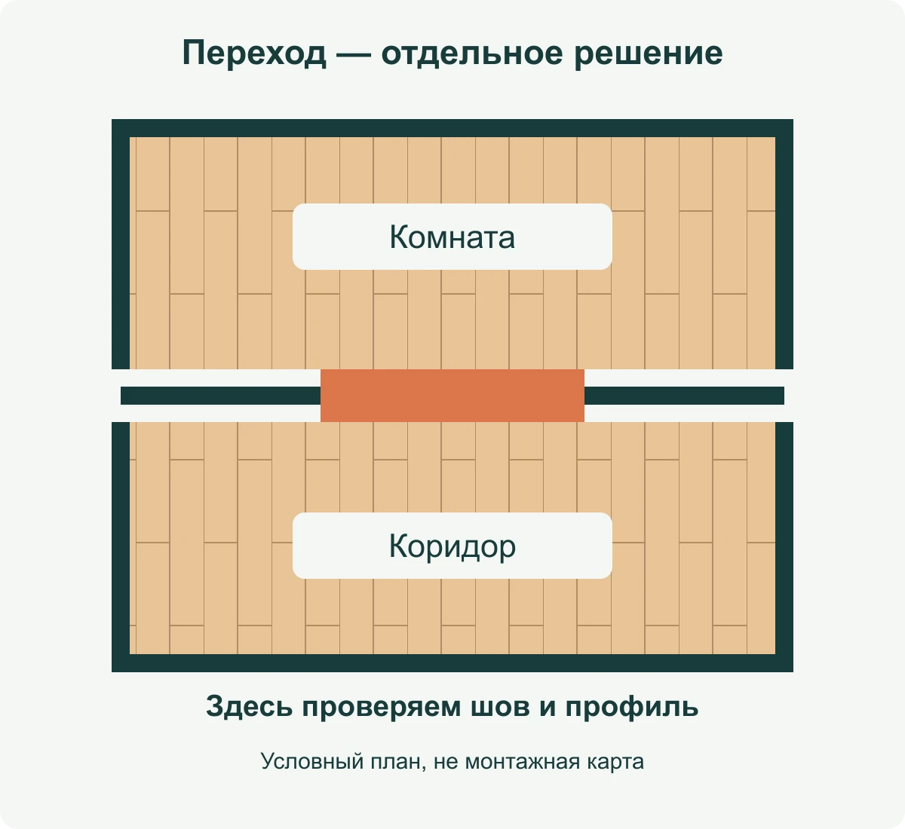

**Укладывать ламинат без разделительного профиля между комнатами можно не всегда.** Такое решение должно соответствовать инструкции именно к вашему покрытию и условиям квартиры. Одинаковый декор во всех помещениях ещё не означает, что пол разрешено собирать одним непрерывным полотном.

Желание убрать порожки понятно: хочется видеть цельный пол, а не металлическую полоску в каждом проёме. Но сначала стоит уточнить, что именно мешает — внешний вид накладки или сам разрыв покрытия. Это разные задачи. Иногда достаточно подобрать неброский профиль, а не менять всю схему укладки.

## Порог, профиль и компенсационный шов — не одно и то же

В бытовом разговоре «порогом» называют и выступающую деталь дверной коробки, и небольшую накладку на стыке полов. Напольный профиль закрывает переход; компенсационный шов — пространство, предусмотренное для движения покрытия. Отсутствие массивного порога не означает отсутствия шва.

Плавающий ламинат не превращается в неподвижную плиту после защёлкивания замков. Например, EGGER объясняет необходимость зазоров у стен возможностью движения и расширения пола и связывает их выбор с размерами помещения и климатическими условиями. Размер из одного FAQ нельзя автоматически переносить на любой стык: для него нужна инструкция конкретной системы. [Пояснение EGGER о зазорах](https://support.egger.com/hc/en-us/articles/360001078858-What-is-the-expansion-requirements-for-Laminate-Flooring).

*На схеме выделен переход, который нужно продумать до раскладки. Цветная полоса обозначает место проверки, а не заданную ширину шва. План условный, без масштаба.*

## Почему нельзя ответить одним числом метров

Указание максимальной длины пола не заменяет требования к дверным проёмам. В российском FAQ Quick-Step предел сплошного участка обсуждается вместе с геометрией и климатом; там же рекомендуется разделять комнаты швом в проёме. Нельзя вырвать допустимую длину из этого контекста и считать её разрешением пройти через всю квартиру. [Российский FAQ Quick-Step](https://www.quick-step.ru/faq/laminat/podgotovka-i-ukladka/kakoy-maksimalnoy-dliny-pol-mozhno-ustanavlivat-bez-temperaturnogo-shva/).

При этом на австралийском сайте того же бренда описана возможность укладки между комнатами без профилей при оговорённых условиях. Там отдельно перечислены ограничения для узких проёмов, габаритов общей поверхности и переходов между зонами с подогревом и без него. Это не универсальный допуск для любой доски с похожим замком. [Условия на австралийском сайте](https://www.quick-step.com.au/en-au/frequently-asked-questions/laminate/preparation-and-installation/do-i-really-need-expansion-joints-between-every-room).

Практический вывод из расхождения простой: сохраните название коллекции, артикул и инструкцию к купленному материалу. Если документы противоречат друг другу, отправьте производителю план помещений и попросите уточнить допустимую схему. Ответ про вашу планировку полезнее общей фразы продавца «все так кладут».

## Что показать мастеру до начала работы

Представьте коридор, из которого двери ведут в спальню и гостиную. Нарисуйте не только площади трёх помещений, но и положение каждого проёма. Отметьте длины стен, отопление, неподвижные элементы и места, где покрытие меняется. По такому плану можно обсуждать конкретные переходы; по сумме квадратных метров — только предварительную потребность в материале.

Попросите мастера показать, где закончатся отдельные участки пола и как будет оформлен каждый стык. Если предлагается непрерывная укладка, следующий вопрос — на какой пункт инструкции опирается решение. Если нужен профиль, согласуйте его до покупки дверей и напольных аксессуаров, а не после подрезки последней доски.

Направление рисунка решайте отдельно. Один декор может выглядеть цельно и с аккуратным переходом. А поворот досок ради красивого вида не отменяет требований к швам. Для выбора рисунка есть [разбор укладки вдоль и поперёк комнаты](/blog/laminat-vdol-ili-poperek-komnaty/).

## Как выбрать аккуратный стыковочный профиль

Сначала сравните уровни готовых покрытий по обе стороны перехода. Профиль для соединения поверхностей на одном уровне и профиль для перепада высот решают разные задачи. У EGGER, например, в системе аксессуаров выделены переходная, выравнивающая и завершающая функции. Это полезный принцип выбора, а не рекомендация покупать конкретную марку. [Варианты профилей EGGER](https://www.egger.com/en/flooring/accessories/skirtings-profiles?lci=bmM9ZXVzMyAg).

В магазине приложите образец профиля к своей доске. Одинаковое слово «дуб» на упаковках не гарантирует совпадение оттенка. Сравните ширину видимой части и то, как переход выглядит при закрытой двери. Возьмите с собой размеры проёма и сведения о высотах покрытий: одного цвета для подбора недостаточно.

Не подменяйте подбор профиля советом «залить всё герметиком». Если хочется обойтись без видимой накладки, сначала найдите допустимый узел в документации покрытия и выбранной системы примыкания. В этой статье нет универсальной схемы заполнения шва или крепления профиля: такие детали нельзя надёжно назначить без конкретных материалов.

## Как посчитать материал, не потеряв переходы

Сначала определите схему разделения помещений, затем проверяйте раскладку. В [инструменте раскладки ламината](/instrumenty/raskladka-laminata/) можно посмотреть ряды и подрезки отдельного прямоугольного участка. Он не согласовывает непрерывный монтаж через несколько комнат и не моделирует узел дверной коробки.

Для предварительной покупки используйте [калькулятор ламината](/kalkulyatory/poly/laminat/) с фасовкой выбранного покрытия. Профили учитывайте отдельно: по конкретным переходам, длинам изделий и возможности их раскроя. Не выводите их количество из общей площади квартиры.

Перед заказом материалов у вас должны остаться три понятные вещи: инструкция к покрытию, план отдельных участков пола и выбранное оформление проёмов. Тогда вопрос «можно без порогов?» получит ответ для вашей квартиры — без догадок по красивой фотографии чужого ремонта.
