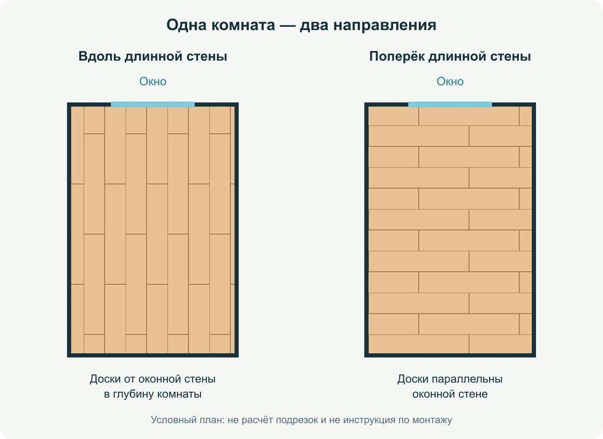
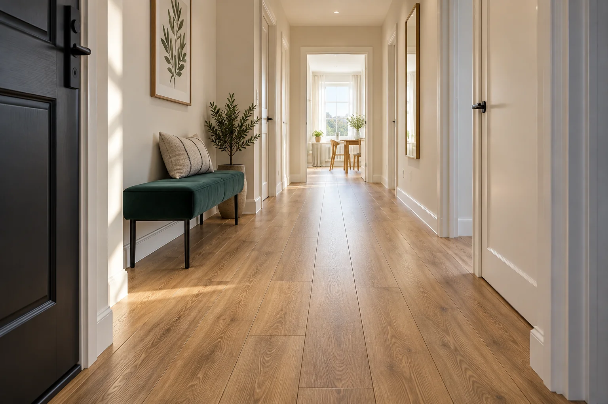
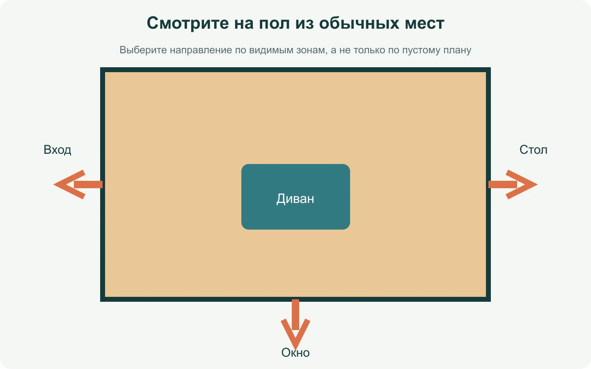
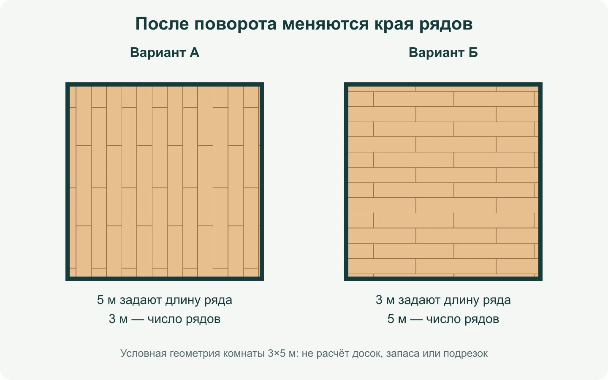

**У ламината нет одного «правильного» направления для всех квартир.** Сначала выберите, откуда вы чаще видите пол, затем сравните вид досок в двух поворотах и только после этого проверьте подрезки и инструкцию к замку. Окно — полезная подсказка, но не команда, которая отменяет планировку, мебель и реальные края рядов.

Спор обычно начинается с простой фразы: «Класть от окна». Для одного это доски, которые уходят от оконной стены в глубину комнаты; для другого — доски, идущие вдоль самой стены с окном. Поэтому решение лучше записать не словами, а на плане: относительно какой стены направлена длинная сторона доски и откуда вы будете смотреть на готовый пол.

*Одна и та же условная комната с неизменным окном. Меняется только направление досок; рисунок стыков условный и не заменяет монтажную раскладку.*

## Сначала определите, что именно сравниваете

В этой статье «вдоль комнаты» — длинная сторона доски параллельна длинной стене, «поперёк» — короткой. В квадратной комнате так говорить неудобно: там точнее «от окна к противоположной стене» или «параллельно оконной стене».

Не смешивайте направление со смещением торцевых стыков. Повернуть доски на 90 градусов и оставить смещение на треть — одна операция. Оставить направление, но изменить смещение с трети на половину — другая. Если сравнивать всё разом, не получится понять, что изменило вид пола и где появились неудобные подрезки. Про выбор смещения есть отдельный разбор: [раскладка ламината на 1/3 или 1/2](/blog/raskladka-laminata-na-tret-ili-polovinu/).

## Начинайте не с окна, а с точки зрения

Представьте комнату 3×5 м: окно на короткой стене, дверь — на противоположной. При входе пол виден вдоль пяти метров. Если доски направлены от окна к двери, продольные линии уходят в глубину. После поворота вы увидите больше поперечных полос. Ни один вариант не «увеличит» комнату физически, но впечатление при входе будет разным.

Отметьте на плане две-три обычные точки: вход, диван, рабочий стол. Потом положите рядом несколько *несобранных* досок в обоих направлениях и посмотрите с этих точек при дневном и вечернем свете. Не пытайтесь защёлкнуть и силой разъединить замок ради примерки: допустимый порядок работы зависит от конкретной системы.

Quick-Step предлагает учитывать направление основного света, поскольку так продольные соединения могут меньше выделяться. Это рекомендация по восприятию, а не обещание невидимых швов: фаска, текстура и угол взгляда всё равно остаются частью рисунка. [Пояснение производителя о направлении](https://www.quick-step.ru/blog/kak-klast-laminat-vdol-ili-poperek/).

*В узком проходе длинные линии особенно заметны. Это иллюстрация восприятия, а не правило, что коридор всегда нужно укладывать именно так.*

## Когда длинная стена важнее света

У окна может быть не один источник света. В гостиной с двумя окнами на соседних стенах невозможно направить доски «по свету» одновременно в обе стороны. В спальне большую часть пола часто закрывает кровать, и важнее участок, который видно из дверного проёма. В коридоре длинный ряд может подчёркивать перспективу, но одновременно сделать узость заметнее.

Сравните не пустую комнату из каталога, а свою планировку. На плане нарисуйте кровать, ковёр, кухонный остров или шкаф. Полоса шириной в несколько сантиметров у стены может почти исчезнуть под мебелью, а некрасивый торец прямо у входа будет виден каждый день.

*Выбирайте направление по зонам, которые реально видите. Стрелки обозначают точки обзора, а не направление монтажа.*

## Почему поворот меняет края, хотя площадь не меняется

Возьмём ту же комнату 3×5 м и доску 192×1285 мм. При направлении вдоль пятиметровой стены длинный размер комнаты определяет длину ряда, а трёхметровый — число рядов. После поворота роли меняются. Площадь комнаты та же, но крайние продольные полосы и торцевые остатки окажутся в других местах.

Это не позволяет сказать «вдоль всегда дешевле». На результат влияют размеры конкретной доски, выбранное смещение, первый ряд и допустимость повторного использования обрезка. У двух вариантов может совпасть количество пачек, но один оставит слишком узкую видимую полосу у двери, а другой — более спокойный край у длинной стены.

*Условное сравнение 3×5 м без расчёта количества досок. Числа на схеме — размеры комнаты, а не монтажные допуски.*

Перед стартом проверьте инструкцию выбранного покрытия. EGGER отдельно напоминает, что стартовую сторону выбирают с учётом сложных мест, а порядок сборки первых рядов зависит от типа замка. Красивый план нельзя ставить выше реального способа собрать покрытие. [Пояснение EGGER о первом и последнем рядах](https://support.egger.com/hc/en-us/articles/360001078578-Installation-of-the-first-and-last-row-of-Laminate-Flooring).

## Практический сценарий: спальня, коридор и дверь

Допустим, в спальню 3×4,8 м входят из коридора, окно на длинной стене, кровать занимает центр. Первый вариант — доски параллельны длинной стене. Второй — направлены к окну. Не выбирайте по одному фото сверху. Откройте дверной проём, положите образцы на видимом участке у входа и отметьте, где пройдут крайние ряды после каждого поворота.

Если в варианте «к окну» крайняя полоса оказывается у входа, а другой вариант даёт аккуратный широкий ряд, это весомый аргумент. Если при этом свет делает стыки заметнее, оцените образец вечером: спальню редко смотрят только днём. Окончательный вывод здесь не «всегда параллельно длинной стене», а «выбран вариант, который лучше выглядит у входа и реально собирается по инструкции».

Дверной проём — отдельная задача. Поворот досок не отвечает на вопрос, можно ли вести одно полотно между комнатами и как оформлять переход. Для этого используйте [разбор ламината без порогов между комнатами](/blog/laminat-bez-porogov-mezhdu-komnatami/).

## Как сравнить два варианта до покупки

Откройте [раскладку ламината](/instrumenty/raskladka-laminata/) и внесите размеры комнаты и доски. Сохраните одинаковое смещение, затем сделайте две схемы, меняя только направление. Смотрите не только на общее число досок: проверьте полосы вдоль стен, торцы у входа и участки, которые останутся открытыми после мебели.

Инструмент рассчитан на прямоугольную поверхность. Ниши, трубы, дверные коробки и сложные примыкания измеряйте отдельно. Для предварительной покупки проверьте фасовку именно вашей коллекции в [калькуляторе ламината](/kalkulyatory/poly/laminat/). Не складывайте результаты раскладки и калькулятора: это два способа рассмотреть одну покупку, а не две потребности.

## Контрольный проход перед заказом

Удобно сделать короткую проверку не в голове, а прямо на плане. Подпишите окно, вход и стену, относительно которой будет лежать длинная сторона доски. Поставьте мебель, которая точно останется на месте: кровать, шкаф-купе, кухню. Это сразу отделяет важные видимые зоны от тех, которые скроет интерьер.

Затем сравните два одинаковых расчёта: та же доска, та же комната, то же смещение — меняется только поворот. У каждого варианта ответьте на четыре простых вопроса. Где будет самый заметный крайний ряд? Как выглядят торцы у двери? Есть ли сложное место, с которого нельзя удобно начать сборку выбранного замка? Не придётся ли из-за соседней комнаты решать отдельный переход?

Если на один из вопросов нет ответа, это не повод выбрать второй вариант наугад. Сначала измерьте участок, положите образец или попросите мастера показать последовательность рядов. Результат инструмента помогает заметить риск заранее, но не заменяет обмер после демонтажа старого пола: дверной проём может оказаться уже, коробка — стоять иначе, а основание — потребовать подготовки.

Для спокойного выбора достаточно сохранить две схемы, фотографию образца у входа и название коллекции. С таким набором можно вернуться к решению через неделю, обсудить его с мастером и не начинать спор заново уже с купленными пачками.

Пять минут такой проверки экономят часы переделок позже.

Хорошее решение можно записать в одной строке: «длинная сторона доски параллельна этой стене; крайние ряды проверены от входа; смещение выбрано отдельно; порядок старта подтверждён инструкцией». Такая запись понятна и вам, и мастеру — и защищает от фразы «я думал, вы имели в виду другое направление».
