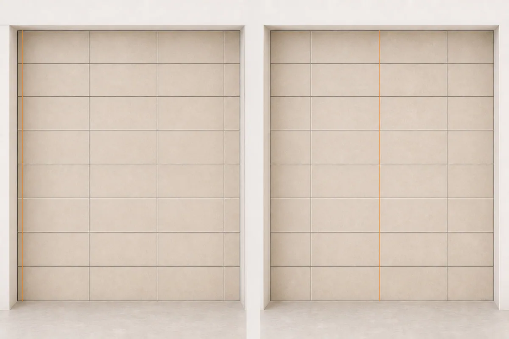
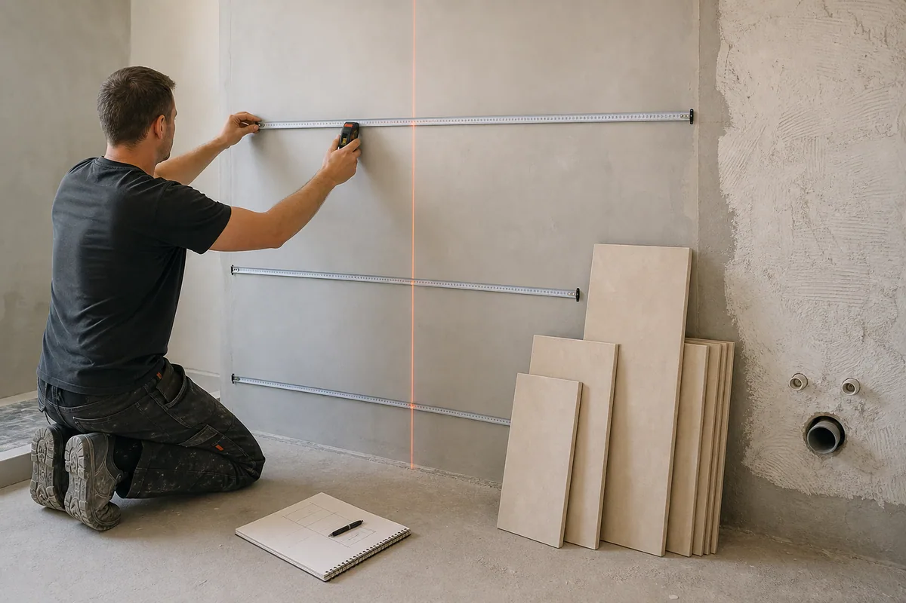
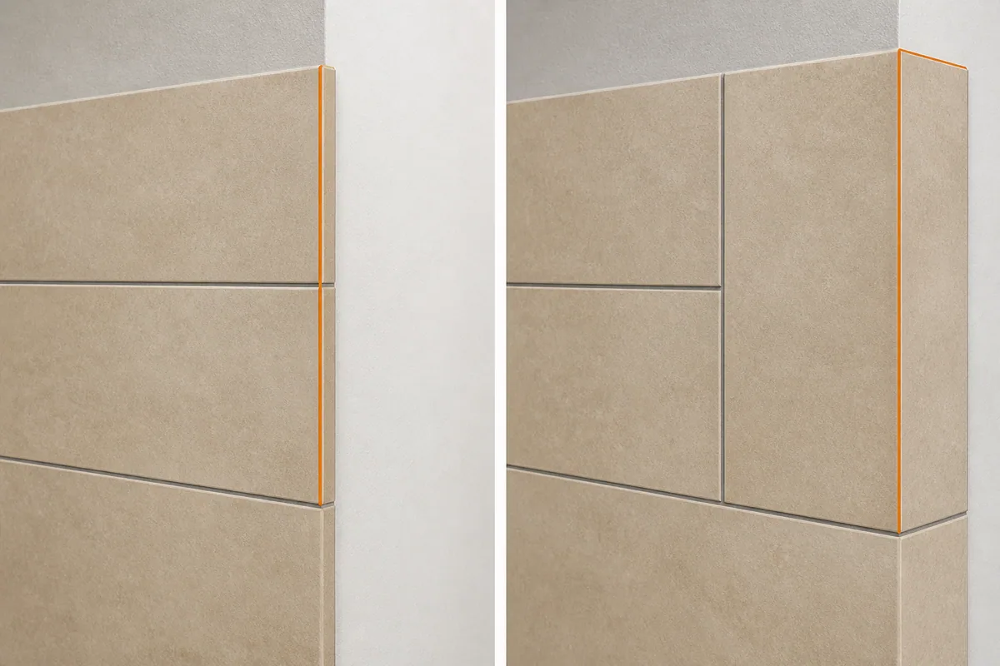
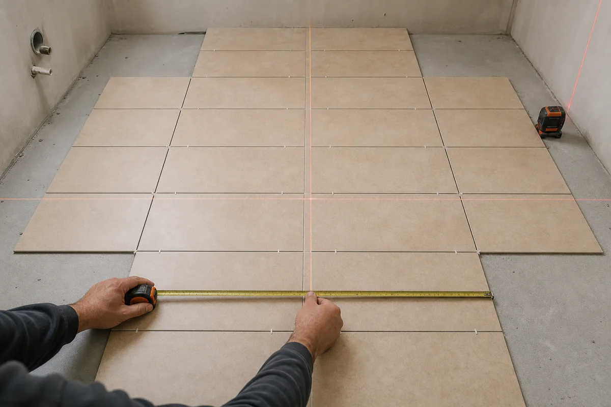
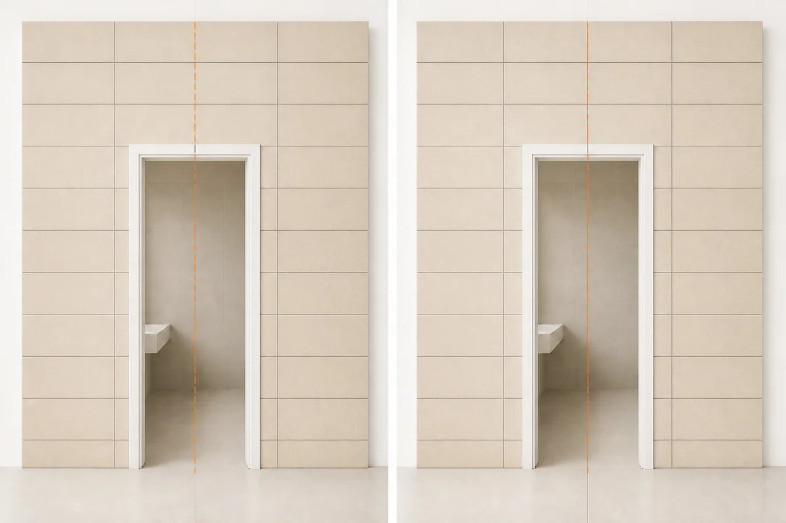
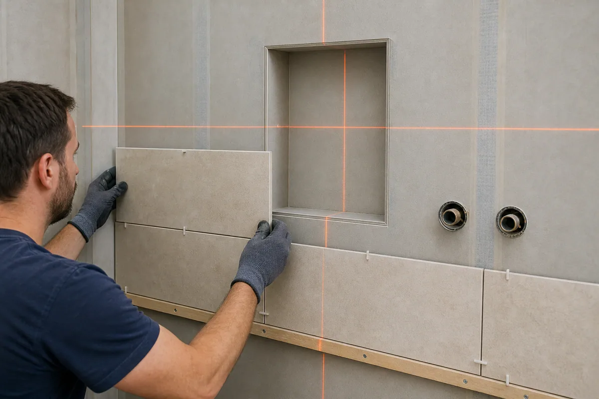
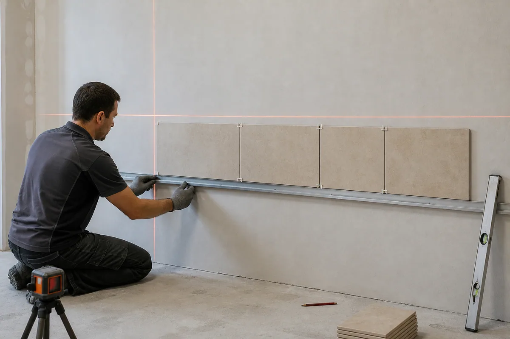
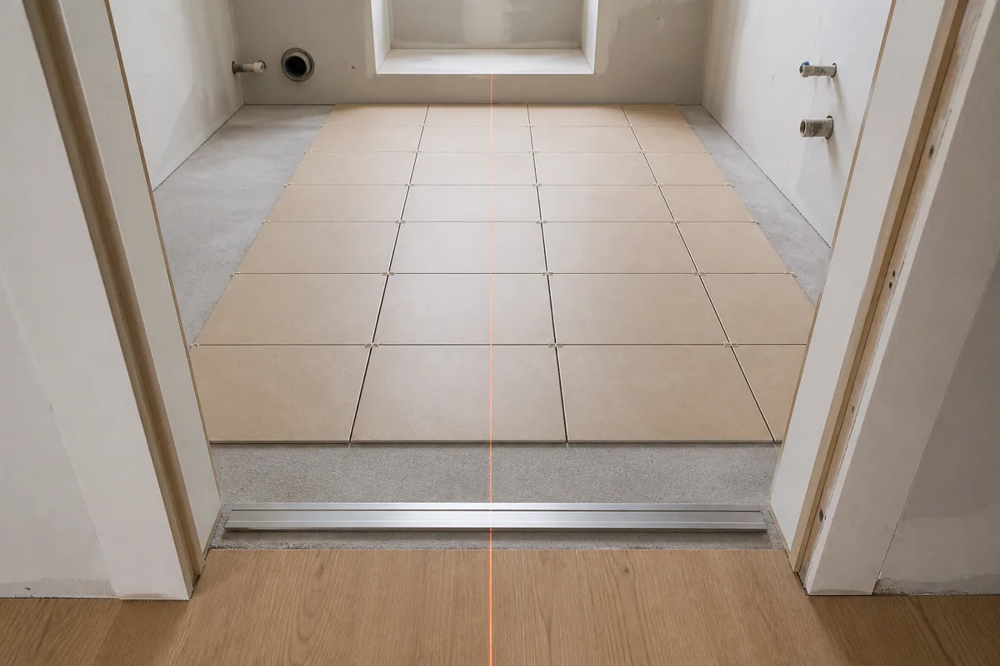
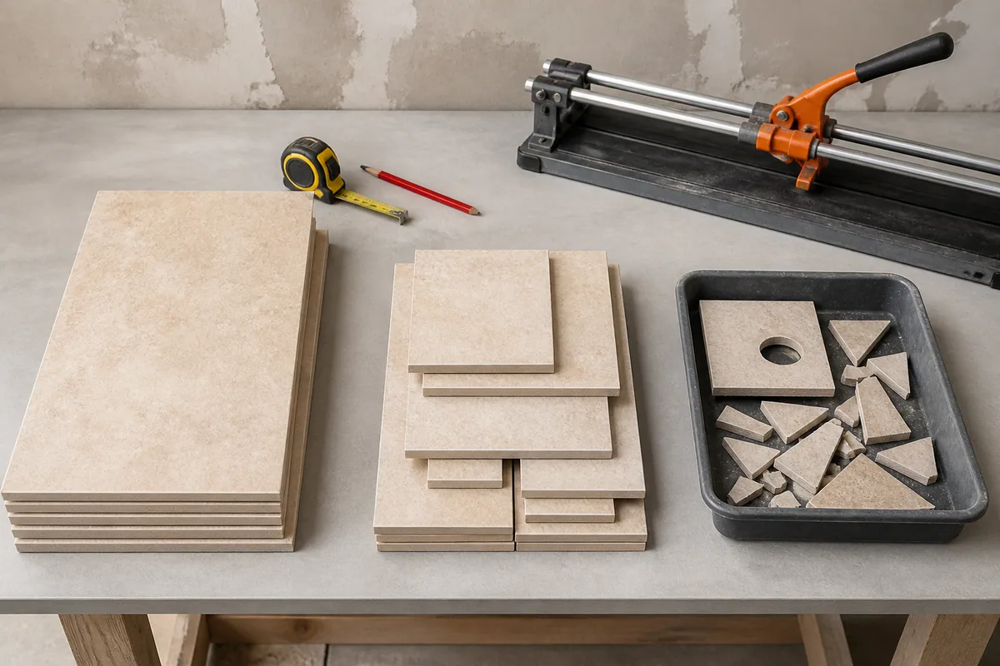

Короткий ответ: **начинать от центра стоит не всегда**. Правильная стартовая линия — та, при которой на заметных границах не остаются тонкие полосы, швы согласованы с дверью, нишей или сантехникой, а количество подрезок остаётся приемлемым. Иногда это центр стены, иногда целая плитка от скрытого угла, а иногда — собственный сдвиг на несколько сантиметров.

До нанесения клея нужно сравнить хотя бы два варианта. В [генераторе раскладки плитки](/instrumenty/raskladka-plitki/) для этого есть режимы «От края», «По центру» и «Свой сдвиг»: инструмент показывает крайние подрезки и количество плитки к покупке для каждого старта.

## Что выбрать: центр, край или свою ось

| Старт раскладки | Когда подходит | Главный риск |
|---|---|---|
| От края | Первый край скрыт мебелью, коробом или примыканием; на противоположной стороне получается достаточно широкий добор | На видимой стороне может остаться узкая полоса |
| По центру | Нужна симметрия на открытой стене или полу; обе границы видны одновременно | Симметричная схема иногда требует больше плитки |
| По оси двери или ниши | Проём — главный визуальный ориентир; важно согласовать его с плиткой или швом | Хорошая ось проёма может ухудшить подрезки по углам |
| Свой сдвиг | Центр и край дают неудобные доборы; нужно сохранить крупные края и контролировать расход | Требуется точная разметка и проверка всей поверхности |

Главная ошибка — выбрать старт по привычке, не дорисовав последний ряд. Первая целая плитка выглядит удобно только в начале работы. Если в конце стены остаётся полоска в несколько сантиметров, исправлять раскладку уже поздно.

### Быстрый алгоритм выбора

Если решение нужно принять без долгих рассуждений, используйте такую последовательность:

1. Определите границы, которые останутся видимыми после установки мебели, сантехники и наличников.
2. Выберите главный ориентир: центр поверхности, дверь, нишу, ванну, раковину или линию перехода покрытий.
3. Постройте вариант от края и вариант по центру с реальным размером плитки и шва.
4. Сразу исключите схемы с хрупкими полосами и сложными Г-образными деталями в заметных местах.
5. Сравните не только симметрию, но и число плиток на схему, подрезку и итог к покупке.
6. Если оба стандартных старта плохие, сдвигайте сетку небольшими шагами и ищите компромисс.

Такой порядок важнее универсального совета «кладите от центра». Он учитывает конкретное помещение и позволяет объяснить, почему выбрана именно эта схема.

## Что меняется при сдвиге стартовой линии

Стартовая линия не меняет размеры помещения или плитки. Она перемещает всю модульную сетку относительно границ, проёмов и оборудования. Из-за этого край, который был целым, становится подрезанным, а тонкая полоса на противоположной стороне может превратиться в широкий добор.

В прямой раскладке удобно мыслить не отдельной плиткой, а модулем: **размер плитки плюс шов**. Для плитки 600 мм и шва 2 мм горизонтальный шаг сетки составляет 602 мм. Но крайний элемент считают по фактическому пересечению плитки с поверхностью: шов за границей стены не добавляют, а проёмы и собственный сдвиг меняют число реально расходуемых элементов.

При центрировании есть два распространённых положения сетки:

- по оси проходит центр целой плитки;
- по оси проходит межплиточный шов.

Эти варианты дают разные крайние элементы, хотя оба в разговорной речи называют раскладкой «от центра». Поэтому при двери, нише или декоративной вставке важно уточнять не только ось, но и то, что именно с ней совмещено.

*Одна и та же поверхность может дать совершенно разные крайние доборы: меняется не формат плитки, а положение всей сетки.*

## Какие данные снять до построения схемы

Точность раскладки ограничена точностью исходных замеров. Размеры из паспорта квартиры или чернового проекта полезны для предварительной оценки, но стартовые линии переносят по подготовленному основанию.

Перед расчётом запишите:

| Что измерить | Почему это влияет на раскладку |
|---|---|
| Ширину и высоту поверхности в нескольких местах | Стена может быть непараллельна, а пол — иметь расхождение по диагоналям |
| Фактический калибр плитки | Номинальные 600×300 мм не всегда равны измеренному размеру конкретной партии |
| Планируемый шов | Даже разница в 1 мм на длинном ряду заметно сдвигает крайнюю подрезку |
| Положение двери, ниши и ревизионного люка | Сетка должна быть проверена по контуру, а не только по общей площади |
| Отметку готового пола и потолка | Нижний и верхний ряды зависят от будущих чистовых уровней |
| Зоны, которые закроет мебель или сантехника | Это помогает правильно расставить визуальные приоритеты |

Для стены ширину проверяют снизу, посередине и сверху. Для пола измеряют обе стороны и диагонали. Если расхождения заметны, в схеме ориентируются на минимальный рабочий размер, а неровность распределяют в подрезках или корректируют основание. Красивая цифровая сетка не исправляет геометрию помещения сама по себе.

Если формат и тип материала ещё не выбраны, сначала определитесь с ними по [руководству по выбору плитки](/blog/vybor-plitki/). Стартовую сетку имеет смысл уточнять уже для конкретной коллекции, потому что размер, направление рисунка и калибр влияют на подрезки.

*В расчёт вводят размеры подготовленной поверхности, положение проёмов и реальный формат плитки — до открытия клея.*

## Почему «всегда начинайте от центра» — слишком простое правило

Центрирование действительно помогает получить одинаковые подрезки слева и справа. На открытой стене это часто выглядит аккуратнее, особенно если взгляд сразу видит оба угла. Но у решения есть цена: ради двух широких симметричных доборов иногда приходится убрать один целый ряд и разрезать дополнительные плитки.

Поэтому центр оценивают по трём критериям:

1. **Видимые края.** Будут ли обе подрезки заметны после установки мебели, ванны, экрана или наличников?
2. **Главная ось.** Что важнее: центр всей стены, центр дверного проёма, смесителя, раковины или декоративной панели?
3. **Закупка.** Сколько целых плиток уйдёт на схему и сколько нужно добавить к покупке?

Если один угол полностью закрывает высокий шкаф, а второй остаётся открытым, геометрическая симметрия стены может быть не нужна. В таком случае разумнее оставить широкий аккуратный добор на видимой стороне, а скрытую подрезку увести за мебель.

## Когда старт от края работает хорошо

Начинать целой плиткой от края можно, если выполнены сразу два условия:

- начальная граница действительно ровная и является правильной базой разметки;
- на противоположной стороне получается не тонкая полоска, а полноценный добор, который можно нормально отрезать и установить.

На полу дополнительно смотрят на вход в помещение. Подрезка, которая первой попадает в поле зрения из дверного проёма, обычно важнее края под ванной или кухонным гарнитуром.

На стене не стоит буквально повторять неровность пола или потолка. Горизонтальные ряды задают по уровню, а верхний и нижний доборы планируют заранее. Если чистовой пол ещё не готов, положение нижнего ряда привязывают к проектной отметке готового пола, а не к случайной точке основания.

## Как понять, что край слишком узкий

Единого обязательного размера подрезки для любого формата и помещения нет. Производитель MAPEI в практическом руководстве советует по возможности избегать элементов меньше половины исходной плитки. Это строгий и безопасный ориентир, но не требование российского ГОСТ или СП.

Генератор «Мастерка» использует более мягкий критерий сравнения: предупреждает о крае **меньше 30% размера плитки**. Это программная эвристика, которая помогает быстро отбраковать явно неудобные варианты. Для плитки шириной 600 мм предупреждение появится при доборе меньше 180 мм.

На практике решение зависит от материала и места реза:

- узкий прямой добор из обычной керамической плитки режется проще, чем такой же фрагмент из толстого керамогранита;
- край под наличником менее заметен, чем полоса в открытом углу;
- Г-образная подрезка вокруг проёма или розетки требует большего запаса прочности, чем простой прямой рез;
- рисунок, калибр и направление фактуры могут запретить повторное использование оставшегося фрагмента.

Поэтому процент — это фильтр для сравнения, а не разрешение автоматически укладывать любой кусок, который оказался чуть шире порога.

*Одинаковый остаток площади может быть распределён по-разному: тонкая полоса у одного края или два более широких симметричных добора.*

### Когда узкая подрезка особенно нежелательна

Число миллиметров — только часть оценки. Даже относительно широкий фрагмент может оказаться плохим, если в нём нужно сделать отверстие, вырез под розетку или длинную Г-образную выборку. И наоборот, небольшой прямой элемент под полностью закрывающим его наличником иногда допустим.

Перед утверждением схемы отдельно отметьте места, где подрезка:

- остаётся на открытом внешнем углу;
- попадает под сверление крепежа или сантехнический вывод;
- образует тонкую перемычку вокруг дверного или ревизионного проёма;
- должна совпасть с профилем, порожком или соседним покрытием;
- будет постоянно видна на уровне глаз;
- не сможет опираться всей площадью из-за сложной формы основания.

В таких узлах лучше увеличить деталь или перенести шов, даже если общая симметрия станет чуть менее идеальной. Визуально аккуратная сетка должна оставаться выполнимой при резке и монтаже.

## Пример: стена 2500×2600 мм и плитка 600×300 мм

Возьмём прямоугольную стену 2500×2600 мм, плитку 600×300 мм, шов 2 мм и запас 10%. Сравним два варианта в инструменте без дверного проёма.

### Вариант 1 — от края

- слева начинается целая плитка;
- справа остаётся подрезка 92 мм;
- снизу получается подрезка 184 мм;
- один край попадает в категорию узких;
- на схему расходуется 45 плиток;
- с запасом 10% к покупке получается 50 плиток.

### Вариант 2 — по центру

- слева и справа остаётся по 346 мм;
- сверху и снизу — по 91 мм;
- по критерию инструмента узких краёв нет: 91 мм немного больше 30% высоты плитки 300 мм;
- на схему расходуется 50 плиток;
- с запасом 10% к покупке получается 55 плиток.

В этом примере центрированная раскладка выигрывает по боковым краям, но требует купить на пять плиток больше. Правильный выбор зависит от того, какие границы останутся на виду. Если верх или низ полностью скрыты, можно проверить собственный сдвиг и найти более экономный компромисс.

*Сначала проверяют оси и крайние элементы, затем фиксируют стартовые линии. Клей на этом этапе ещё не нужен.*

## Центр плитки или шов по центру двери

Если на стене есть дверной проём, центрировать можно двумя способами:

- провести ось проёма через центр плитки;
- совместить ось проёма с межплиточным швом.

Оба решения могут выглядеть логично. Выбор зависит от ширины проёма, формата плитки и положения боковых подрезок. Например, центральная плитка над дверью создаёт цельный акцент, но может оставить узкие Г-образные фрагменты у косяков. Шов по оси двери иногда упрощает рисунок, но делит верхнюю зону пополам.

В генераторе можно указать положение проёма и нажать «Совместить раскладку с осью проёма». Инструмент сравнит центр плитки и межплиточный шов, сначала исключит варианты с узкими краями, затем учтёт расход и количество подрезок.

*Сначала фиксируют ось проёма, затем отдельно сравнивают центр плитки и шов на этой линии. Решение принимают после проверки боковых и верхних подрезок.*

Важно смотреть не только на полотно двери. После монтажа часть плитки перекроют коробка и наличники, а верхний ряд над проёмом останется видимым целиком. Поэтому размеры проёма для раскладки фиксируют от той же базовой границы, что и всю поверхность, и отдельно учитывают будущую ширину обрамления.

## Четыре типовых сценария на объекте

### Открытая акцентная стена

Если вся стена видна от угла до угла, равные боковые доборы обычно воспринимаются спокойнее. Здесь центр поверхности — хорошая первая версия, но не окончательный ответ. Нужно проверить, что верхний и нижний ряды не стали слишком узкими и что центр плитки не конфликтует с раковиной, зеркалом или смесителем.

Для стены с выраженной фактурой дополнительно проверяют направление рисунка. Симметричные размеры доборов не спасут композицию, если две одинаковые прожилки окажутся рядом или рисунок оборвётся на главной оси.

### Стена с ванной, коробом или высоким шкафом

Когда один край полностью скрыт, геометрически равные подрезки могут только увеличить расход. Практичнее сначала обеспечить целую или широкую плитку у открытого угла, а менее удачный добор перенести за экран ванны, мебель или короб.

Скрытая зона всё равно должна быть облицована технически корректно, но её визуальный приоритет ниже. Такой подход особенно полезен, когда центрированная версия требует дополнительной коробки плитки только ради симметрии, которую после ремонта никто не увидит.

### Душевая зона с нишей и выводами

В душевой главной осью часто становится не центр стены, а ниша, трап, смеситель или душевая стойка. Здесь сначала строят крупную сетку всей стены, затем проверяют каждый сложный контур. Нельзя оптимизировать нишу отдельно, если из-за этого у внешнего угла появляется тонкая полоса.

*Сложные узлы проверяют внутри общей сетки стены: ниша, смеситель и углы не должны решаться как независимые раскладки.*

Полезно заранее отметить плитки с отверстиями и Г-образными вырезами. Их нельзя считать обычными прямоугольными остатками: часть материала может стать непригодной для повторного использования, а на случай ошибки при резке нужен резерв той же партии.

### Пол с входом и переходом покрытия

На полу зритель в первую очередь замечает линию от двери и стык с соседним материалом. Если в проёме установлен профиль или порожек, сетку проверяют относительно его фактического положения. Для беспорожного перехода особенно важны ширина крайнего элемента и совпадение высот готовых покрытий.

Центр комнаты не всегда совпадает с центром видимой зоны. Большую часть пола могут закрыть кухня, шкафы или ванна, поэтому раскладку оценивают из точки входа и по свободным проходам.

## Как проверить раскладку до начала работ

1. Измерьте фактическую ширину и высоту подготовленной поверхности в нескольких местах.
2. Укажите реальный размер плитки и планируемую ширину шва.
3. Сравните старт «От края» и «По центру».
4. Посмотрите четыре крайние подрезки, а не только левую и правую.
5. Добавьте дверь или нишу и проверьте её ось.
6. Если оба варианта неудобны, задайте собственный сдвиг.
7. Отдельно сравните количество на схему, запас и итог к покупке.
8. Перенесите выбранные оси на основание и сделайте сухую проверку нескольких рядов.

Сухая раскладка особенно полезна для плитки с выраженным рисунком, заметной разнотонностью или ограниченным числом вариантов фактуры. Она позволяет заранее разнести похожие элементы и не получить рядом две одинаковые прожилки.

## Что учитывать на стене

Для стены важна не только горизонтальная симметрия. До старта нужно решить:

- где окажется верхний ряд относительно потолка;
- будет ли нижний ряд опираться на готовый пол или подрезаться после него;
- совпадают ли швы на соседних стенах;
- как сетка проходит через нишу, ревизионный люк, смеситель и розетки;
- какой край закрывают наличник, экран ванны или мебель.

Если помещение облицовывается по кругу, отдельная красивая стена не должна ломать швы в углах. Сначала определяют общую логику помещения, затем уточняют старт каждой плоскости.

*Лазер и контрольная рейка фиксируют выбранную сетку на основании. Разметка должна пережить нанесение клея и оставаться проверяемой по ходу работы.*

Для первого рабочего ряда часто используют временную ровную опору или профиль. Это не означает, что нижний ряд всегда остаётся целым: его окончательную высоту определяют по раскладке и отметке готового пола. Перед переносом линий также решают, где будет проходить герметизируемое примыкание и какие углы закроет профиль.

## Что учитывать на полу

На полу основными ориентирами становятся:

- линия взгляда от входа;
- ось дверного проёма;
- граница перехода в другое покрытие;
- открытые участки между мебелью и сантехникой;
- деформационные и конструктивные швы основания.

Раскладкой нельзя «перенести» или проигнорировать обязательный деформационный шов. Такие узлы определяются конструкцией пола и системой материалов, а декоративную сетку подстраивают под них, а не наоборот.

*Пол оценивают из дверного проёма: открытый проход и стык покрытий обычно важнее зон под стационарной мебелью.*

Если плитка продолжается между несколькими помещениями без порога, сначала выбирают общую базовую ось и проверяют накопление шага сетки на всей длине. Независимый центр в каждой комнате может привести к несовпадающим швам в дверях. Для раздельных покрытий, напротив, граница проёма позволяет менять направление или старт, если узел перехода это допускает.

## Как связаны раскладка и запас плитки

Подрезка на картинке и запас к покупке — не одно и то же.

Генератор сначала строит геометрию и считает плитки, реально расходуемые на схему. После этого отдельно добавляется выбранный практический запас. Для диагональной раскладки инструмент применяет минимум 15%, потому что угловых и непарных обрезков становится больше.

Фактический запас также зависит от:

- сложности проёмов и ниш;
- возможности повторно использовать подрезки;
- рисунка и направления плитки;
- риска боя при резке и переноске;
- наличия плитки той же партии для будущего ремонта.

После выбора схемы количество плитки, клея и затирки можно проверить в [калькуляторе плитки](/kalkulyatory/poly/plitka/). Раскладка отвечает на вопрос «как расположить элементы», а калькулятор — «сколько материала покупать».

*Остаток становится полезной подрезкой только тогда, когда подходит по размеру, рисунку и направлению для следующего участка.*

### Почему одинаковый процент запаса даёт разный результат

Две схемы с запасом 10% могут требовать разного количества коробок. Сначала меняется базовое число плиток, реально пересекающих поверхность и проёмы. Затем добавляется процент, результат округляется до целых плиток, а при покупке коробками — до целой упаковки.

Например, 50 и 51 плитка до упаковки могут превратиться в одинаковые шесть коробок, если в коробке по 10 штук. Но при другой фасовке второй вариант уже потребует дополнительную упаковку. Поэтому финально сравнивают четыре числа:

1. плитки на чистую схему;
2. дополнительные плитки запаса;
3. плитки к покупке после округления;
4. целые коробки и ожидаемый остаток.

Данные о количестве плиток в коробке берут с этикетки конкретной коллекции или карточки производителя. Формат 600×300 мм сам по себе не определяет фасовку: одинаковый размер может продаваться разным числом штук в зависимости от толщины, массы и серии.

## Семь ошибок, из-за которых хорошая схема портится на объекте

### 1. Считать по проектному размеру до подготовки основания

Штукатурка, выравнивание, гидроизоляция и облицовка соседних плоскостей меняют рабочие границы. Предварительный расчёт можно сделать заранее, но финальные оси проверяют по подготовленной поверхности.

### 2. Использовать только номинальный формат плитки

Для закупки надписи 600×300 мм достаточно, но на длинном ряду фактический калибр и выбранный шов влияют на крайний добор. Перед разметкой измеряют несколько плиток из партии и сверяются с рекомендациями производителя.

### 3. Вычитать проём только по площади

Площадь двери уменьшает чистую облицовку, но контур проёма создаёт дополнительные резы. Плитка, пересекающая косяк, может расходоваться целиком, даже если видимой останется только часть.

### 4. Оценивать только левый и правый край

Центрирование по горизонтали иногда создаёт тонкий верхний или нижний ряд. Для стены всегда проверяют четыре стороны, для пола — весь периметр и линию входа.

### 5. Считать любой обрезок повторно используемым

Остаток должен подходить по обеим сторонам, направлению фактуры и качеству реза. Узкая полоса или фрагмент после отверстия не возвращается в расчёт как полноценная плитка.

### 6. Размечать каждую стену независимо

Внутренние и наружные углы связывают соседние плоскости. Если швы должны продолжаться по периметру, их высоту и шаг задают общей системой, а не отдельным красивым центром каждой стены.

### 7. Начинать укладку без контрольной раскладки

Экран выглядит убедительно, но не показывает разнотон, повтор рисунка и фактическую геометрию каждой плитки. Несколько сухо разложенных рядов позволяют подтвердить решение до нанесения клея.

## Частые вопросы

### Обязательно ли начинать плитку от центра стены?

Нет. Центр нужен, если он улучшает видимые края или поддерживает важную ось. Если один край скрыт и на открытой стороне получается хороший добор, старт от края может быть практичнее.

### Что делать, если при центре получаются две тонкие полосы?

Сдвинуть сетку примерно на половину плитки или задать собственный старт. Часто это заменяет две тонкие полосы на два более крупных добора. Точное значение зависит от размера поверхности, плитки и шва.

### Нужно ли совмещать шов с центром двери?

Не обязательно. Сравните два решения: шов на оси и центр плитки на оси. Выбирают вариант без неудобных краёв и сложных подрезок у косяков.

### Можно ли просто вычесть площадь двери из площади плитки?

Для предварительной площади — можно, но для раскладки этого недостаточно. Плитки, которые пересекают контур проёма, всё равно требуют резки, а отдельные остатки не всегда подходят для повторного использования.

### Сколько вариантов стоит сравнить?

Минимум два: от края и по центру. Для заметной стены с дверью или нишей стоит добавить вариант по оси проёма и один собственный сдвиг.

### Можно ли начинать раскладку от двери?

Да, если дверной проём — главный визуальный ориентир. Но старт «от двери» всё равно нужно продолжить до противоположных границ и проверить, какие подрезки получатся у стен, мебели и перехода покрытия.

### Учитывается ли ширина шва при выборе старта?

Да. Шов входит в шаг модульной сетки, поэтому его задают до сравнения вариантов. На длинной поверхности разница даже в 1 мм между швами может заметно изменить размер крайнего элемента.

### Что лучше поставить на ось: центр плитки или шов?

Оба варианта рабочие. Центр плитки часто создаёт цельный акцент, а шов по оси может упростить симметрию проёма. Выбирают по боковым подрезкам, сложным резам и общей композиции, а не по названию способа.

### Нужно ли совмещать швы стены и пола?

Не всегда. Совпадение может выглядеть аккуратно при одинаковом или согласованном модуле, но разные форматы часто требуют самостоятельной сетки. Важно заранее решить узел примыкания и не обещать совпадение, которое невозможно выдержать по всему помещению.

### Как выбирать старт для диагональной раскладки?

Диагональную сетку обычно центрируют относительно поверхности или главной видимой оси, затем проверяют крайние треугольники по всему периметру. Из-за большого числа непарных угловых остатков инструмент применяет для такой схемы запас не меньше 15%.

### Когда собственный сдвиг лучше центра и края?

Когда стандартные варианты дают тонкую полосу, сложный вырез или лишнюю упаковку. Собственный сдвиг позволяет сохранить крупные доборы в видимых местах, но его нужно точно зафиксировать от базовой линии и проверить сухой раскладкой.

### Можно ли использовать эту схему как монтажный проект?

Генератор помогает выбрать геометрию и оценить закупку, но не заменяет проект сложного узла. Деформационные швы, гидроизоляция, подготовка основания, выбор клея и конструктивные ограничения проверяются отдельно по документации системы и условиям объекта.

## Источники и границы рекомендаций

- [MAPEI Reference Guide: Tile & Stone Installation Systems](https://cdnmedia.mapei.com/docs/librariesprovider65/line-technical-documentation-documents/25-1673-ca---com---web---ref---guide---tiling-grouting---instructions---lr.pdf?sfvrsn=9a34e48a_3) — планирование резки и рекомендация по возможности избегать элементов меньше половины плитки.
- [MAPEI: планирование раскладки настенной плитки](https://www.mapei.com/id/en/blog/detail/blog/2023/01/11/10-tahapan-pasang-keramik-di-dinding) — разметка видимой стены и проверка тонких крайних полос до нанесения клея.
- [Генератор раскладки плитки «Мастерок»](/instrumenty/raskladka-plitki/) — сравнение стартовых линий, крайних подрезок, проёма и количества к покупке.

Порог 30% в инструменте — практический критерий сравнения, а не строительная норма. Статья не заменяет проект облицовки, требования производителя плитки, клея и основания. Для деформационных швов, крупного формата и сложных оснований решение проверяют по документации выбранной системы.
