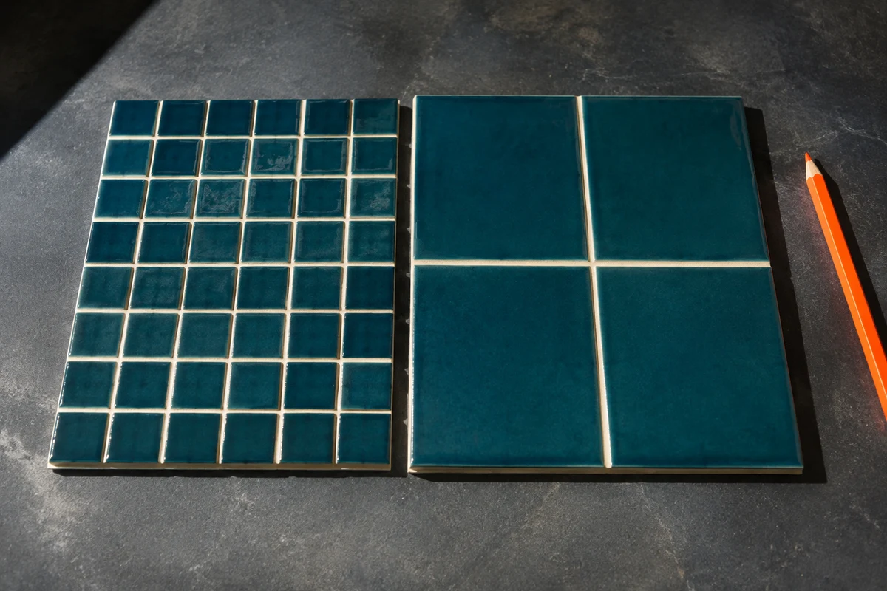
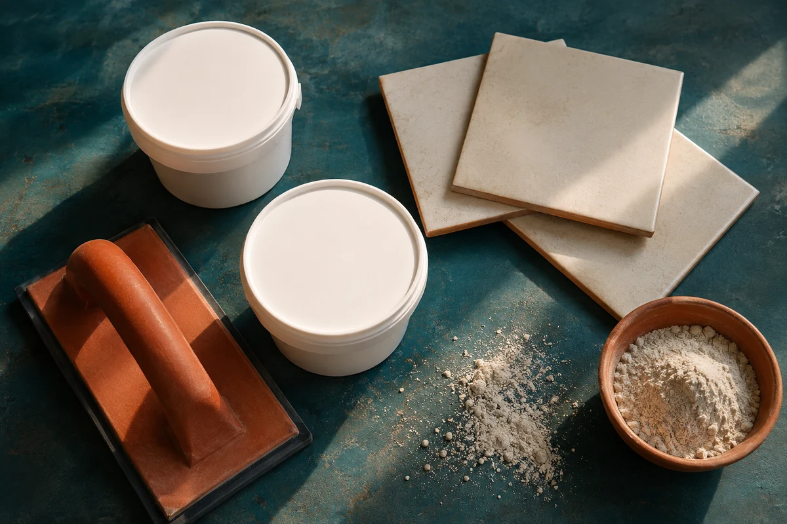

**Одинаковая площадь плитки не означает одинаковый расход затирки.** На квадратном метре мелкого формата больше швов, чем на крупном. А если при той же плитке увеличить ширину шва с 2 до 3 мм, геометрический объём заполнения вырастет примерно в полтора раза — при неизменной глубине и одинаковом составе. Поэтому совет «двух килограммов на ванную хватит» без размеров плитки и швов почти ничего не говорит.

Разберём, откуда берутся килограммы и в какой момент они превращаются в целые упаковки. Числа ниже — прозрачный учебный расчёт, а не таблица расхода конкретной марки. Для покупки результат нужно сверить с технической картой выбранной затирки.

## Почему мелкий формат требует больше затирки

Представьте две одинаковые стены. Первую облицевали квадратами 100 × 100 мм, вторую — 600 × 600 мм. Площадь одинакова, но сетка мелкой плитки значительно гуще: в ней больше погонных метров горизонтальных и вертикальных швов. Именно эти промежутки заполняются составом; площадь лицевой поверхности сама по себе его не расходует.

Для прямоугольной сетки ориентировочную длину швов на квадратный метр удобно оценить как **1000 / A + 1000 / B**, где A и B — стороны плитки в миллиметрах. Получаются метры швов на квадратный метр облицовки. Для 300 × 300 мм это около 6,67 м, для 600 × 600 мм — около 3,33 м.

Это приближение для сравнения вариантов, а не точная ведомость каждого пересечения и краевого участка. Оно не учитывает ширину шва в шаге сетки, конкретный периметр стены, фигурные элементы и форму кромок. Для мозаики сложной формы или глубокого рельефа разумнее опереться на расчёт производителя и пробный участок.

*На мелком формате сетка швов гуще. Иллюстрация создана с помощью ИИ и показывает принцип, а не точные размеры образцов.*

## Что меняется при шве 2, 3 или 5 мм

У шва есть не только длина, но и поперечное сечение: ширина × глубина заполнения. Если остальные параметры не менять, расширение с 2 до 3 мм увеличивает его объём на 50%, а с 2 до 5 мм — в 2,5 раза. Это ещё не значит, что покупать придётся во столько же раз больше упаковок: округление к фасовке работает ступенчато.

В таблице для всех форматов приняты одна и та же **условная глубина 6 мм и расчётный коэффициент массы 1,6 кг на литр заполнения**. Коэффициент выбран для демонстрации геометрии; это не универсальная паспортная плотность сухих смесей, готовых растворов или эпоксидных составов. Потери и дополнительный запас пока не включены.

| Формат плитки, мм | Шов 2 мм, кг/м² | Шов 3 мм, кг/м² | Шов 5 мм, кг/м² |
|---|---:|---:|---:|
| 100 × 100 | 0,384 | 0,576 | 0,960 |
| 300 × 300 | 0,128 | 0,192 | 0,320 |
| 600 × 600 | 0,064 | 0,096 | 0,160 |
| 1200 × 600 | 0,048 | 0,072 | 0,120 |

Таблица отвечает на вопрос «как влияет геометрия», а не «какая затирка подойдёт». Нельзя уменьшать шов до 2 мм только ради экономии: допустимую ширину выбирают с учётом плитки, основания, условий эксплуатации и документации облицовочной системы. Сам заполнитель тоже должен допускать выбранную ширину.

## Глубина шва: незаметный параметр с большим влиянием

При одинаковом формате и ширине заполнение на 8 мм вместо 6 мм увеличит расчётный объём на треть. Поэтому две внешне похожие облицовки могут потребовать разную массу состава. На расход влияют фактическое сечение, фаска, рельеф кромки и подготовка шва.

Не стоит самостоятельно уменьшать глубину заполнения, оставляя внутри клей ради экономии затирки. Подготовку и заполнение выполняют по инструкции выбранного продукта. Например, [официальная инструкция LITOCHROM 1-6 EVO](https://www.litokol-market.ru/catalog/zatirochnye-smesi/litochrom-1-6-evo/) требует очистить швы и отдельно описывает их заполнение. Для другого состава правила и расчётные характеристики нужно проверять заново.

В паспорте производителя может использоваться собственная формула через толщину плитки или готовая таблица. Не подменяйте её автоматически нашей условной глубиной 6 мм: сначала выясните, какие параметры заложены в конкретный метод расчёта.

## Пример: сколько купить на 20 м²

Возьмём плитку 300 × 300 мм, шов 3 мм и те же учебные условия: глубину 6 мм, коэффициент 1,6 кг/л. На каждый квадратный метр по таблице приходится 0,192 кг. На 20 м² базовая расчётная потребность составит **3,84 кг**.

Допустим, для этого примера отдельно решили предусмотреть 10% на потери. Это принятое условие задачи, не обязательная норма для любого ремонта. Тогда получаем 3,84 × 1,10 = **4,224 кг**. При выбранной фасовке 2 кг потребуется три упаковки, то есть **6 кг к покупке**. Разница между покупкой и потребностью с этим запасом — 1,776 кг.

Если ту же облицовку в учебном сравнении посчитать со швом 2 мм, базовая потребность составит 2,56 кг, с таким же запасом — 2,816 кг, а покупка — две упаковки по 2 кг. Изменение одного миллиметра в этом конкретном примере меняет заказ с двух упаковок на три. При другой площади или фасовке переход может произойти в другой точке.

Округлять нужно общий результат каждого одинакового состава и цвета, а не каждый квадратный метр отдельно. Если стены и пол требуют разных продуктов или цветов, для них составляют отдельные расчёты: остаток одного состава нельзя автоматически зачесть вместо другого.

*К покупке считают целые упаковки выбранного продукта. Иллюстрация создана с помощью ИИ; показанные ёмкости не обозначают конкретную марку или фасовку.*

## Почему расход на упаковке может отличаться

Геометрия объясняет основное направление изменений, но не заменяет испытания продукта. Разные составы имеют разные расчётные характеристики; часть материала остаётся на инструменте и поверхности. При сложной фактуре и небольших участках фактические потери также могут отличаться от принятого примера.

Нельзя выбрать «эпоксидную» вместо «цементной» только потому, что общий калькулятор показал меньше килограммов. Сначала проверяют пригодность конкретного продукта, затем его расход и фасовку. В инструкции LITOCHROM 1-6 EVO производитель, в частности, рекомендует для крупных проектов проверить расход на опытном участке. Такой подход полезнее попытки получить универсальную цифру для всех смесей одного типа.

## Как использовать калькулятор «Мастерка» без ложной точности

В [калькуляторе затирки для плитки](/kalkulyatory/poly/zatirka/) можно сравнить площадь, формат, ширину шва и выбранную фасовку. Но важно учитывать текущие границы модели: ширина задаётся целыми миллиметрами, глубина автоматически выбирается по формату, а поле толщины плитки пока справочное и массу не меняет. Переключатель типа задаёт условный коэффициент, а не паспорт конкретной марки.

В модели уже предусмотрены запас и сценарные поправки. Поэтому её итог не обязан совпадать с таблицей выше, где глубина специально зафиксирована одинаковой для всех форматов. Проверяйте показанные допущения и не добавляйте поверх готового результата ещё один такой же запас по привычке.

Если сама раскладка ещё не утверждена, сначала посмотрите [начало от центра и от края](/blog/otkuda-nachinat-raskladku-plitki/) и проверьте швы в [генераторе раскладки плитки](/instrumenty/raskladka-plitki/). Для кухни отдельно полезен [разбор фартука с розетками и подрезками](/blog/raskladka-plitki-na-kuhonnom-fartuke/). Когда формат и шов выбраны, расчёт затирки становится не догадкой, а понятной цепочкой: геометрия → условия конкретного состава → потери → целые упаковки.
