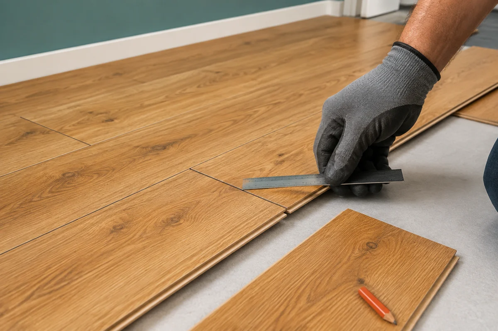
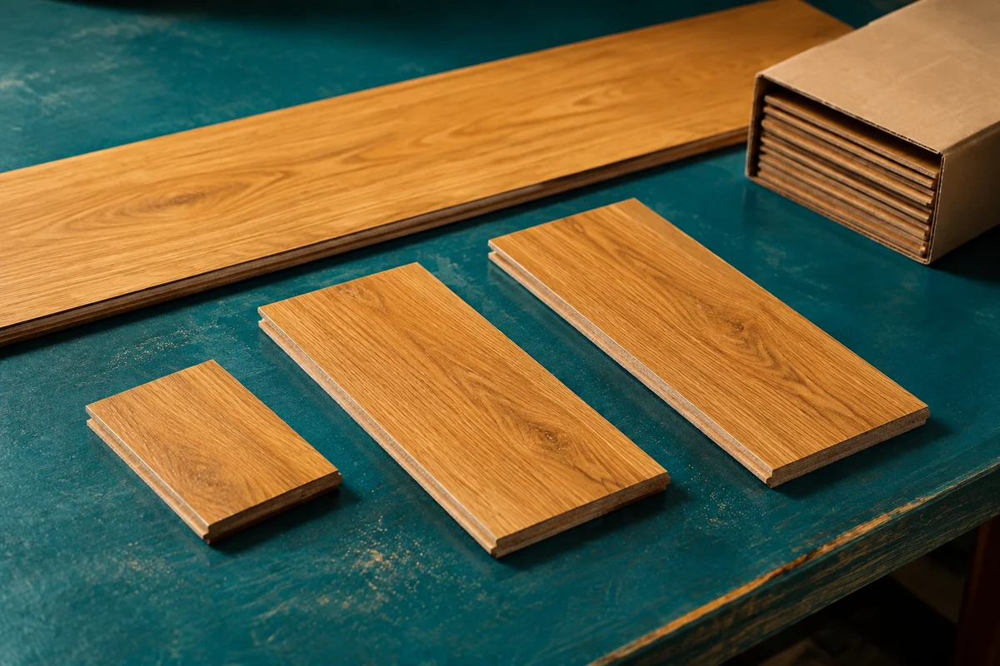

**И раскладка на 1/3, и раскладка на 1/2 могут быть удачным решением.** Половина доски даёт регулярный рисунок с повтором через ряд, треть — ступенчатое расположение торцов с повтором через три ряда. Выбирать стоит по инструкции к конкретному ламинату, виду открытого пола и подрезкам у стен. Сама дробь ещё не говорит, какая схема окажется дешевле.

В магазине разница кажется исключительно декоративной: здесь стыки стоят «кирпичиками», там уходят лесенкой. Но после замера комнаты выясняется, что красиво начатый ряд заканчивается коротким фрагментом, а оставшийся кусок не подходит для начала следующего. Поэтому рисунок лучше выбирать вместе с раскроем, пока доски ещё целые.

## Что означает смещение на треть и половину

Смещение — это положение торцевых соединений соседних рядов относительно друг друга. Доски при этом лежат параллельно. Поворота на 90 градусов, как в ёлочке, здесь нет: палубная раскладка и ёлочка — разные схемы, для которых может требоваться разный материал.

При раскладке на половину повторяются два положения стыков. Если первый ряд начинается с целой доски, следующий можно начать с половины, а третий — снова с целой. В варианте на треть удобный учебный цикл состоит из целой доски, одной трети и двух третей. Затем он повторяется. На объекте стартовые длины могут отличаться: сетку подстраивают под границы комнаты.

Для доски длиной 1200 мм геометрия выглядит так:

| Параметр | Раскладка на 1/3 | Раскладка на 1/2 |
|---|---|---|
| Шаг смещения | 400 мм | 600 мм |
| Условные начала первых рядов | 1200 → 400 → 800 мм | 1200 → 600 → 1200 мм |
| Повтор положения стыков | Через три ряда | Через два ряда |
| Впечатление от рисунка | Ступенчатое движение торцов | Регулярный «кирпичный» ритм |

Это объяснение рисунка, а не готовая карта резки. Таблица не учитывает длину комнаты, зазоры, ширину пропила и требования к крайним деталям. Нельзя нарезать всю пачку по этим трём числам, не проверив противоположную стену.

## Сначала инструкция, потом красивый рисунок

Важна не только доля длины доски, но и расстояние между ближайшими торцевыми стыками соседних рядов. Одна треть короткой панели и одна треть длинной — разные расстояния в миллиметрах. Название схемы не заменяет проверку допустимой разбежки.

Например, в [руководстве Quick-Step по монтажу ламината](https://quick-step.ru/laminate/installation/) рекомендуется разносить торцевые соединения соседних рядов на 30 см или больше. Это указание производителя для его покрытия, а не универсальная российская норма для любого замка. Для выбранной коллекции нужно читать её актуальную инструкцию: требования к смещению, крайним фрагментам и монтажу могут отличаться.

*Сравнивают расстояние между стыками соседних рядов, а не только длину стартового кусочка. Иллюстрация показывает этап проверки, без точного масштаба.*

Не стоит путать два ограничения: минимальную длину крайней детали и минимальное расстояние между стыками. Обрезок может быть достаточно длинным сам по себе, но поставить его в конкретный ряд всё равно нельзя — соединение окажется слишком близко к соседнему. Обратная ситуация тоже возможна: разбежка выглядит хорошей, а крайняя деталь неудобно мала.

## Какой вариант выглядит спокойнее

У половинного смещения торцы через ряд возвращаются на одну линию. На ламинате с выраженной фаской этот ритм заметен особенно хорошо. Кому-то нравится порядок, а кому-то повтор кажется слишком строгим. Сам по себе такой рисунок не является ошибкой, если он разрешён изготовителем покрытия.

У смещения на треть цепочка торцов проходит через три положения. Она может создавать заметные диагональные «ступени», хотя сами доски уложены прямо. Поэтому обещание, что треть обязательно выглядит естественнее, тоже слишком категорично. Многое зависит от фаски, контраста древесного рисунка и того, какая часть пола останется открытой.

Полезнее сравнить несколько рядов в зоне, которую видно от входа, чем рассматривать один стык вблизи. Диван, ковёр и шкафы закроют часть сетки; центральный проход останется на виду. При одинаковой схеме разные сочетания декора могут менять впечатление сильнее, чем сама разбежка. Совпадающие рисунки на соседних досках стоит замечать ещё при сухой примерке.

## Почему треть не всегда экономнее половины

Количество отходов зависит от того, какие отрезки получаются в конце рядов и где их удаётся использовать. Удачный остаток одного ряда может стать началом другого. Но для этого должны совпасть длина, нужная сторона замкового соединения, направление декора и допустимое расстояние до соседних торцов.

Рассмотрим только один ряд, не всю комнату. Если рабочая длина ряда после учёта предусмотренных зазоров равна 4300 мм, то три целые доски по 1200 мм оставят место под деталь 700 мм. Если вырезать её из новой доски, остаток будет немного меньше 500 мм: часть материала уйдёт в пропил. Такой остаток потенциально можно подрезать до 400 мм, но превратить в 600 мм нельзя.

На этом легко сделать поспешный вывод в пользу трети. Однако в других рядах крайние размеры будут уже иными. При другой длине комнаты подходящие куски могут чаще появляться у половинного смещения. Один удачный обрезок не доказывает экономичность всей схемы.

*Полезный остаток должен подходить не только по длине. Проверяют замок, кромку и положение будущего стыка; небольшой кусок не считается повторно использованным автоматически.*

И ещё одно различие: деталей на рисунке может быть больше, чем исходных досок, из которых их вырезали. Две подходящие подрезки иногда получают из одной планки. Поэтому число нарисованных фрагментов нельзя без проверки принимать за количество целых досок к покупке.

## Проверьте ширину последнего ряда

Смещение на треть или половину меняет торцы, но само по себе не исправляет узкую полосу вдоль длинной стены. За неё отвечает другой размер — ширина доски и число рядов поперёк помещения.

Если начать с целого ряда, на противоположной стороне может остаться неудобный продольный добор. Тогда проверяют подрезку первого ряда, чтобы перераспределить ширину между двумя краями. Допустимую ширину крайних досок и зазоры берут из инструкции к покрытию. В комнате с непараллельными стенами одного замера у двери недостаточно.

Это полезно разделить мысленно: сначала направление длинной стороны доски, затем ширина первого и последнего рядов, затем разбежка торцов. Иначе можно долго выбирать между 1/3 и 1/2, не заметив более существенную проблему по краю пола.

## Как сравнить два варианта в генераторе

Откройте [генератор раскладки ламината](/instrumenty/raskladka-laminata/) и задайте размеры помещения и доски. Сначала сравните «Палуба 1/3» и «Палуба 1/2» при одинаковом направлении укладки. Если одновременно поменять направление и смещение, будет сложнее понять, из-за чего изменились подрезки и количество материала.

Посмотрите на оба конца рядов и последнюю полосу у стены. Затем сопоставьте доски на схему и количество к покупке. Генератор учитывает повторное использование подходящих отрезков по своей расчётной модели, но не проверяет физическую пригодность каждого замка конкретной коллекции. Перед закупкой раскрой нужно сверить с материалом и инструкцией.

После этого можно отдельно проверить поворот направления. Иногда он влияет на результат сильнее перехода с трети на половину. Схема прямоугольной поверхности также не заменяет обмер ниш, труб и сложных дверных примыканий: эти участки требуют дополнительной проверки на объекте.

## Как перейти от сравнения к покупке

Сначала определяют потребность по выбранному раскрою, затем учитывают оговорённый запас, после чего округляют до реальной упаковки. Остаток из-за покупки целой пачки — отдельная величина, а не ещё один процент расхода.

Условный пример: согласованная потребность с запасом уже составляет 73 доски, в пачке восемь. Купить нужно десять пачек, то есть 80 досок; семь останутся сверх рассчитанных 73. Это только пример округления, не результат для комнаты из предыдущего раздела и не рекомендация конкретного запаса.

Для предварительной оценки по площади есть [калькулятор ламината](/kalkulyatory/poly/laminat/). Его результат и результат генератора сравнивают как два способа оценки одной закупки, а не складывают. Общий порядок подсчёта площади и пачек разобран в [статье о расчёте ламината на комнату](/blog/kak-rasschitat-laminat-na-komnatu/).

Хороший выбор между 1/3 и 1/2 можно объяснить без слова «всегда»: эта схема разрешена изготовителем, хорошо смотрится на открытом участке, не оставляет неприемлемых крайних деталей и даёт понятную закупку. Если оба варианта проходят такую проверку, решающим становится ваш вкус.

## Источники и границы материала

Рекомендация Quick-Step о разбежке проверена по официальному руководству 5 сентября 2026 года. Геометрические примеры в статье учебные; возможности генератора сопоставлены с текущим расчётным модулем «Мастерка». Монтажные требования нужно проверять для конкретной коллекции, основания и помещения.

Изображения созданы с помощью ИИ. Это поясняющие иллюстрации, а не фотографии наших работ и не точные карты раскроя.
