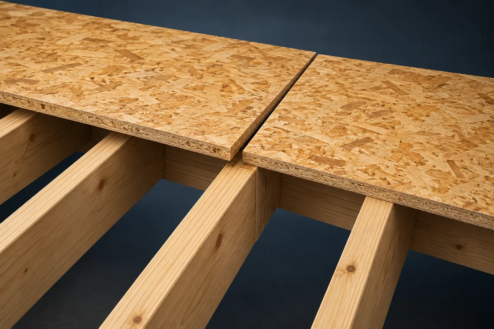
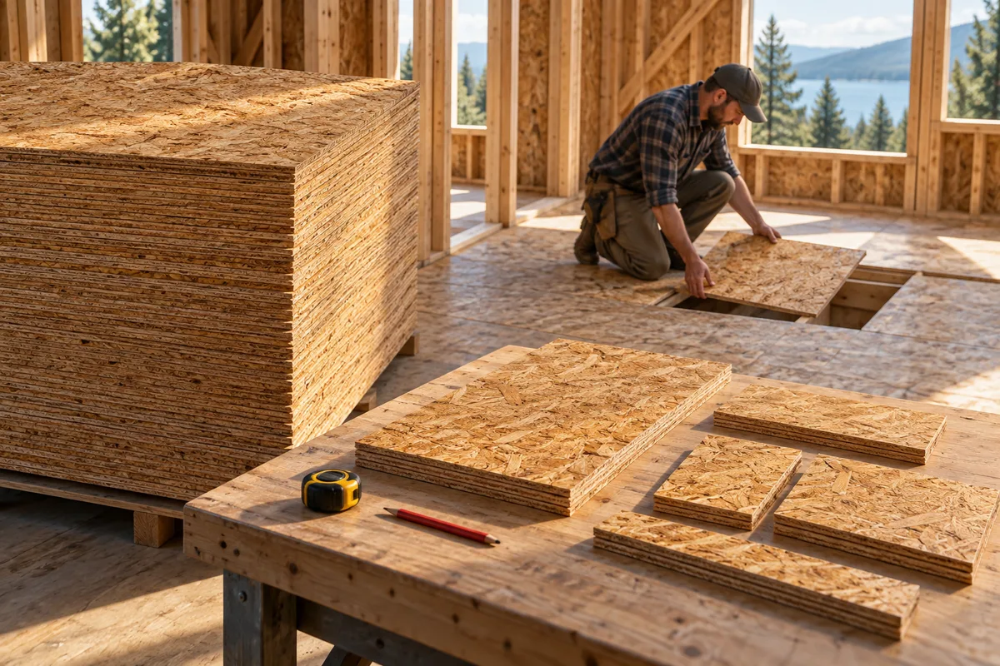

**Для пола 3 × 4 м в нашем примере карта раскладки использует пять листов ОСП 1 250 × 2 500 мм. При выбранном резерве 5% к покупке получается шесть целых листов: пять идут в раскрой, один остаётся закрытым запасом.** Деление площади пола на площадь листа показывает лишь нижнюю границу — четыре штуки. Оно не отвечает, где пройдут швы, каких размеров будут крайние детали и удастся ли разместить их на физических листах.

Это не универсальная норма для любого пола. Ниже приведены входные данные, шесть монтажных деталей и честные ограничения [инструмента раскладки листов](/instrumenty/raskladka-listov/). Размеры листа, зазор и запас в собственном проекте нужно заменить на фактические, а конструкцию основания проверить отдельно.

## Почему 12 ÷ 3,125 — ещё не покупка

У листа 1 250 × 2 500 мм площадь 3,125 м². У прямоугольного пола 3 000 × 4 000 мм — 12 м². Простая арифметика даёт `12 ÷ 3,125 = 3,84`. Значит, меньше четырёх целых листов по площади не хватит. Но это **не доказательство, что четырьмя можно закрыть поверхность**. Целую плиту нельзя превратить в жидкость и без потерь разлить по узким полосам у стены.

В нашем расчёте выбран один слой прямокромочной ОСП, разбежка рядов на половину ширины листа и межлистовой зазор 3 мм. Три миллиметра — **условие этой схемы**, а не инструкция для всех ОСП. Под конкретную марку, толщину и тип кромки сверяйте паспорт производителя. Шпунтованная плита соединяется иначе: например, у [EGGER есть отдельное руководство для OSB tongue-and-groove](https://www.egger.com/get_download/30918a3f-cceb-482c-8884-6a530f4c0eff/TL_EGGER_TLBP104_OSB_t_g_basic_installation_guideline_en.pdf?country=RO). Нельзя без проверки перенести на неё зазор из примера с прямой кромкой.

Ещё до карты стоит решить, куда направлена силовая ось плиты относительно лаг и на что опираются стыки. Эти сведения не возникают из площади комнаты. Онлайн-схема показывает размеры деталей и раскрой, но не знает шага лаг и не проверяет несущую способность. Поэтому сначала определяют конструктивную схему по проекту и инструкции своей плиты, затем проверяют, подходит ли под неё раскладка.

## Две полосы, шесть деталей

Если открыть [раскладку ГКЛ и ОСП](/instrumenty/raskladka-listov/), выбрать «Пол 3 × 4 м», «ОСП-плита 1 250 × 2 500», один слой, разбежку на половину, зазор 3 мм и автоориентацию, инструмент выбирает направление листа вдоль длины поверхности. Для этого набора обе сравниваемые ориентации дают по пять листов в раскрое, но у выбранной четыре детали с резом, а у альтернативной — шесть. Это конкретное сравнение, а не общее правило, что длинная сторона всегда должна смотреть именно так: положение лаг и требования производителя важнее удобного числа резов.

Схема состоит из двух полос. Первая закрывает 2 500 мм длины пола, затем идёт поперечный шов 3 мм; вторая полоса имеет длину 1 497 мм. В каждой полосе также учтены два поперечных зазора по 3 мм:

| Полоса | Детали слева направо | Контроль ширины 3 000 мм |
|---|---|---|
| Первая, 2 500 мм | 1 250 × 2 500; 1 250 × 2 500; 494 × 2 500 мм | 1 250 + 3 + 1 250 + 3 + 494 |
| Вторая, 1 497 мм | 625 × 1 497; 1 250 × 1 497; 1 119 × 1 497 мм | 625 + 3 + 1 250 + 3 + 1 119 |

Сложение в правом столбце в обоих случаях даёт 3 000 мм. По длине тоже сходится: `2 500 + 3 + 1 497 = 4 000 мм`. Так можно проверить ввод и расположение швов прежде, чем обсуждать закупку. Из шести деталей только две совпадают с целым форматом листа; четыре надо резать. На [живой карте](/instrumenty/raskladka-listov/) видны и их положение на полу, и раскрой каждого покупного листа.

*ИИ-иллюстрация принципа опирания прямых кромок. Она не показывает фактический шаг лаг, толщину плиты или точное положение швов нашей карты. Это проверяют по проекту и документации выбранного продукта.*

Красивый план на экране не исправит неподдержанный торец. В случае пола по лагам нужно проверить, чтобы опоры приходились под требуемые стыки и края, а выбранное направление плиты соответствовало её рабочей оси. Если каркас уже смонтирован иначе, двигайте швы и пересчитывайте детали; не подгоняйте лаги «на глаз» под красивую картинку. Для пола по другому основанию порядок проверки будет другим.

## Пять листов в карту, шестой — только резерв

После размещения шести деталей алгоритм распределяет их по физическим листам **без поворота обрезков**. Для выбранной карты используются пять листов 1 250 × 2 500 мм. Два идут целиком на крупные детали. На остальных трёх размещаются четыре подрезки, причём две из них инструмент располагает на одном листе. Это план программы для заданных размеров, не доказанный математический минимум для любого способа раскроя и не инструкция к резке без контрольного замера.

Площадь пяти листов — `5 × 3,125 = 15,625 м²`. Площадь деталей **без межлистовых зазоров** в паспорте раскладки округлена до 11,97 м². Разница — около 3,66 м² открытых обрезков. Интерфейс показывает 23,4% вне деталей относительно площади пяти листов в раскрое. Эти остатки не обязаны быть мусором: часть может пригодиться в другом месте, если её размеры, ориентация и состояние подходят. Нельзя объявить все 3,66 м² экономией для следующей комнаты, пока там нет проверенного списка деталей.

*ИИ-иллюстрация закупки и сортировки обрезков, не фотография вычисленной карты. Число листов и размеры деталей берите из паспорта инструмента, а не считайте предметы на изображении.*

Отдельное поле «запас 5%» добавляет к пяти листам `ceil(5 × 0,05) = 1` **целый** лист. Поэтому на экране «Купить: 6 листов» означает пять листов с картами реза и один закрытый резерв на возможный брак или изменение планировки. Фактический резерв в штуках здесь составляет 20% от пяти базовых листов — следствие округления маленького заказа, а не тайная надбавка алгоритма. Если проект и условия позволяют работать без запасного листа, явно поставьте 0%: при неизменной схеме к покупке останутся пять. Если резерв нужен, не прибавляйте ещё один лист «для верности» поверх уже показанного без отдельной причины.

## Что проверить до оплаты и первого реза

Самый дорогой промах здесь — не арифметический. Можно правильно сложить площади и нарезать детали, но выбрать неподходящую толщину ОСП или оставить стык без опоры. Инструмент не рассчитывает нагрузку, прогиб, шаг лаг, класс и толщину плиты, крепёж, влажностный режим или совместимость с финишным покрытием. Он также считает **сплошной прямоугольник**: трубы, люки, выступы и сложные примыкания в нашей шестидетальной карте отсутствуют. Не вычитайте их площадь автоматически: иногда вырез не уменьшает количество покупных листов и меняет расположение стыков.

До закупки нужны четыре конкретных решения: взять спецификацию своей плиты, сопоставить её с опорами и направлением силовой оси; проверить требования производителя к швам и периметру; посмотреть каждую карту реза и доступность нужного формата в магазине; выбрать резерв осознанно. [Технические материалы EGGER по ОСП](https://www.egger.com/en/building/consulting-planing-realization/downloads?country=EE) — пример того, почему инструкция должна относиться к конкретному продукту, а не к абстрактному слову «ОСП».

Если вместо пола нужны листы гипсокартона на стену, в этом же инструменте меняются материал и поверхность, но монтажные требования уже другие: стойки, торцевые стыки и слои. А для расчёта профилей и крепежа используйте [системный калькулятор гипсокартона](/kalkulyatory/steny/gipsokarton/), не приписывая их одной карте листов. Произвольный мебельный раскрой множества разных деталей по листам — тоже отдельная задача, которую эта раскладка не обещает решить.

Итог нашего примера: **12 м² пола, шесть монтажных деталей, пять плит ОСП в раскрое и шестая только при выбранном 5%-м резерве**. Четыре листа из деления площадей были нижней оценкой, но не готовым заказом. Проверьте свою поверхность в [онлайн-раскладке листов](/instrumenty/raskladka-listov/), а затем сопоставьте результат с реальными лагами и паспортом плиты до первого реза.
