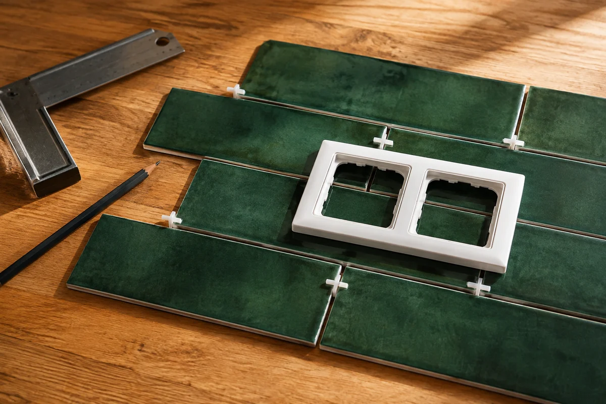
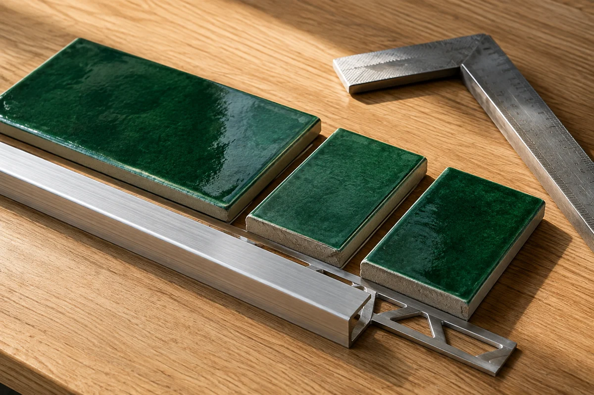

**Раскладку плитки на кухонном фартуке стоит начинать с чертежа кухни, а не с первого ряда.** На одной развёртке стены должны встретиться столешница, верхние шкафы, вытяжка, розетки и плиточные швы. Тогда можно заранее увидеть, где останется узкая полоска, не упрётся ли рамка розетки в рельеф плитки и как закончится облицовка у открытого торца.

На пустой стене симметричная сетка почти всегда выглядит убедительно. Но кухня закрывает часть этой стены: справа появляется высокий пенал, сверху — шкафы, а в самом заметном месте оказывается блок розеток. Раскладка, которая была красивой сама по себе, начинает спорить с мебелью. Исправлять это удобнее на бумаге, пока плитка лежит в коробках.

## Сначала определите границы фартука

Высота фартука — не готовая универсальная цифра из интернета. Нужны отметка верха установленной столешницы и отметка низа верхних шкафов. В зоне вытяжки верхняя граница может отличаться; расстояния до варочной поверхности принимают по документации к выбранной технике и проекту кухни, а не подгоняют под красивый ряд плитки.

Отдельно обозначьте видимую часть и полный контур облицовки. При монтаже до мебели часть плитки может заходить за шкафы или ниже столешницы. Такой заход согласуют с мебельщиком: важны крепления, задние стенки, толщина облицовки и способ примыкания. В рекомендациях [KERAMA MARAZZI о размерах фартука](https://ekb.kerama-marazzi.com/blog/stati/podbiraem-razmer-plitki-chto-nuzhno-znat-chtoby-ne-oshibitsya/) габариты тоже привязаны к расстановке мебели. При этом величину захода для конкретной кухни нельзя выбирать без её монтажной схемы.

Ширину проверьте на нескольких высотах. Между столешницей и шкафами стена может оказаться не совсем прямоугольной. Если один край закрывает пенал, а второй открыт со стороны обеденного стола, на чертеже это два разных края: у открытого важны рисунок, ширина последней плитки и оформление торца.

## Почему три ряда по 20 см не всегда дают 60 см

У плитки есть фактический размер, у облицовки — ещё и швы. Поэтому размер на ценнике нельзя просто умножить на число рядов. Перед окончательной разметкой измерьте несколько плиток из поставленной партии и проверьте рекомендованную ширину шва для этой коллекции.

Возьмём условную рабочую высоту **600 мм уже после вычета верхнего и нижнего примыканий**. Если фактическая высота плитки 200 мм, а два внутренних шва — по 3 мм, три целых ряда займут 606 мм: 3 × 200 + 2 × 3. В таком примере один из рядов придётся уменьшить суммарно на 6 мм или иначе распределить подрезку. Уменьшать швы вопреки инструкции ради совпадения размеров не стоит.

Если же фактическая высота плитки 198 мм, те же три ряда со швом 3 мм займут ровно 600 мм. Это два разных учебных примера, а не утверждение, что любая плитка «20 × 30» имеет размер 198 мм. Разница небольшая на отдельной плитке, но уже заметная на готовом фартуке.

Смотрите и на то, какая часть верхнего ряда останется видимой из обычного положения человека. Полоска непосредственно под шкафом и такая же полоска на открытой стене возле вытяжки выглядят по-разному. Лучше оценить оба участка до выбора стартовой высоты.

## Откуда начинать по ширине: от края или от оси кухни

Ось всей стены не обязательно совпадает с осью видимой части фартука. Для кухни с открытой зоной вытяжки разумно сравнить раскладку относительно этой зоны и относительно всей облицовки. Если один конец почти полностью закрыт мебелью, идеальная симметрия по полной длине может вообще не давать заметного преимущества.

Для сравнения возьмём прямой ряд: рабочая ширина **2470 мм после вычета боковых примыканий**, фактическая длина плитки 300 мм, внутренний шов 2 мм. Здесь можно получить такие варианты:

| Вариант ряда | Что помещается по ширине | Крайние элементы |
|---|---|---|
| Старт с целой плитки | 8 целых плиток, 8 швов и один добор | 300 мм слева, 54 мм справа |
| Равные подрезки | 7 целых плиток, 8 швов и два добора | По 177 мм с каждой стороны |

Во втором варианте на доборы остаётся 2470 − 7 × 300 − 8 × 2 = 354 мм. Пополам — 177 мм. Первый вариант не становится автоматически неправильным: если короткий добор полностью скрывается за пеналом, он может быть приемлемым. Но на открытом краю разница между 54 и 177 мм будет заметна.

Это сравнение геометрии одного прямого ряда, **не готовая ведомость закупки**. Повторное использование обрезков зависит от их размеров, пропила, рисунка и нужной заводской кромки. Для общего принципа выбора старта есть отдельный разбор [раскладки плитки от центра и от края](/blog/otkuda-nachinat-raskladku-plitki/).

## Розетки проверяйте вместе с рамками

На чертеже нужны не только центры подрозетников, но и внешний размер выбранной рамки. Именно рамка будет видна поверх плитки. У рельефного «кабанчика» она может захватить фаску или перепад поверхности, хотя сами отверстия на схеме выглядят аккуратно.

До укладки полезно разложить несколько плиток насухо со швами и приложить отдельную рамку нужной серии. Так проще заметить, где рамка опирается на плоскую часть, а где появляется щель. Если розетки уже выведены, обычно сначала пробуют сдвинуть плиточную сетку. Перенос электрики — отдельная работа, которую согласуют со специалистом; красивый шов не повод самостоятельно менять подключение или нарушать требования к размещению оборудования.

*Проверяют внешний контур рамки, а не только отверстия. Иллюстрация создана с помощью ИИ; это пример композиции, не монтажная схема.*

Не стоит стремиться любой ценой поместить каждое отверстие в середину целой плитки. Иногда аккуратный вырез пересекает шов. Решение зависит от формата, прочности остающихся перемычек и способа обработки. На раскладке важно заранее обнаружить тонкий фрагмент между отверстием и краем, а окончательный узел согласовать с плиточником и электриком. Статья не заменяет проект электроснабжения и не описывает работы под напряжением.

## Кабанчик, вертикальная укладка или прямая сетка

У горизонтальной раскладки без смещения проще проследить общие вертикальные линии. Это удобно, если рисунок хочется согласовать с открытыми краями и мебелью. Но совпадение каждого шва со стыком фасадов не обязательно: разные ширины шкафов могут сделать такую задачу бессмысленной.

У «кабанчика» со смещением рисунок живее, зато крайние подрезки меняются от ряда к ряду. Проверять только нижний ряд недостаточно: во втором может появиться совсем короткий кусок. Рельеф и фаски дополнительно влияют на посадку рамок и оформление торцов.

При вертикальной раскладке сначала проверьте высоту: удачно ли заканчиваются длинные плитки под шкафами и возле вытяжки. Поворот формата меняет и частоту швов, и места вырезов. Удачный вариант на фотографии чужой кухни может не совпасть с вашими размерами.

Ёлочка требует отдельной проверки крайних фрагментов и раскроя. Диагональный режим обычной сетки не равен ёлочке, поэтому подменять одну схему другой в расчёте нельзя. Выбирайте способ, который подходит конкретной коллекции и который действительно можно воспроизвести имеющимся инструментом.

## Открытый торец и примыкание к столешнице

Если фартук заканчивается на открытой стене, способ оформления торца выбирают до укладки. Это может быть подходящий профиль или предусмотренный коллекцией завершающий элемент. Его видимая ширина и положение участвуют в разметке: сначала определяют, где закончится готовая облицовка, и только потом считают последнюю подрезку.

*Профиль примеряют к выбранной плитке заранее. Изображение создано с помощью ИИ и показывает материалы, а не готовый конструктивный узел.*

Примыкание к столешнице нельзя считать обычным межплиточным швом. Для него выбирают узел герметизации, совместимый со столешницей и облицовкой, по инструкциям производителей. Например, у силиконового состава [Ceresit CS 25](https://www.ceresit.ru/ru/products/tiling/grouts-and-sealants/cs_25_silicoflexx) есть ограничения для мрамора, известняка, ряда металлов и контакта с пищей. Поэтому совет «возьмите любой санитарный силикон» здесь не подходит.

Углы и примыкания заранее отмечают на развёртке. Их размеры не нужно незаметно добавлять к межплиточному шву или забывать при подсчёте рядов.

## Как проверить фартук в онлайн-раскладке

В [генераторе раскладки плитки](/instrumenty/raskladka-plitki/) выберите стену и задайте размеры одного прямоугольного участка фартука. Затем укажите фактический формат, ширину шва и поддерживаемую схему. Сравните начало от края и от центра, посмотрите крайние подрезки. В режиме своего старта учитывайте, что вертикальная стартовая подрезка задаётся от верхнего края поверхности.

Для Г-образной кухни проверяйте каждую стену отдельно, но сохраняйте согласованную высоту горизонтальных швов в углу. Если над основной полосой есть дополнительная облицовка за вытяжкой, её тоже нужно включить в общий план: простой прямоугольник основной части её не учитывает.

**Генератор не проектирует кухню и не расставляет розетки.** Его проём предназначен для дверного проёма от нижней границы стены, а не для блока подрозетников. Вырезы под розетки и нестандартный контур проверяют отдельно на развёртке. Небольшая площадь отверстия также не означает экономию целой плитки: плитка с вырезом всё равно расходуется.

После выбора схемы переходите к [расчёту плитки и материалов](/kalkulyatory/poly/plitka/). Различайте площадь облицовки, расход целых плиток на раскрой, дополнительный запас и округление до упаковок. Если запас уже включён в перенесённый результат, не прибавляйте его повторно. Сложные вырезы и пригодность обрезков нужно сверить с мастером до покупки.

Хорошая раскладка фартука — та, у которой заранее понятны открытые края, ряды под шкафами и участки вокруг розеток. Красивый рисунок важен, но ещё важнее, чтобы он сошёлся с реальной кухней без неожиданной полоски в самом заметном месте.
