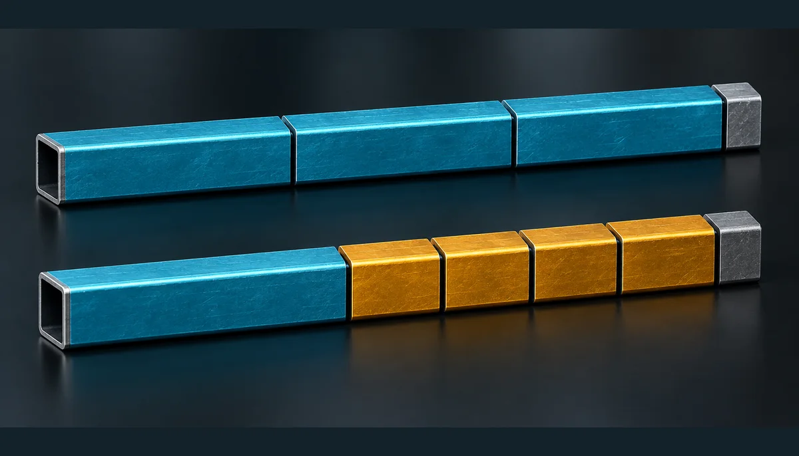
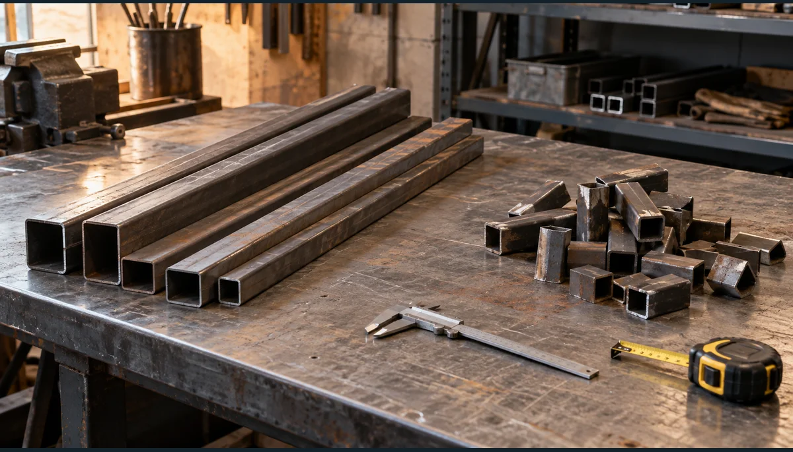

**Для восьми деталей общей длиной 11,2 м в нашем примере нужны два целых хлыста профильной трубы по 6 м.** Но деление `11,2 ÷ 6` — только нижняя граница. Чтобы действительно уложить детали в две заготовки, надо разместить каждую длину, учесть пропил и проверить, что остаётся на концах. Ниже — две конкретные карты реза, которые можно повторить в [инструменте линейного раскроя](/instrumenty/lineynyy-raskroy/).

Сразу оговорим границу: это план нарезки по длине, а не проект металлоконструкции. Сечение трубы, нагрузки, сварные узлы, углы и порядок сборки определяются отдельно. Все миллиметры здесь — условия демонстрационного примера, а не универсальная норма покупки.

## Сначала список деталей, потом количество хлыстов

Представим, что для рамы по готовому чертежу нужны четыре стойки по 1 900 мм и четыре поперечины по 900 мм. Поставщик предлагает трубу хлыстами по 6 000 мм. Ширину пропила выбранного инструмента примем равной 3 мм; если фактический диск или способ резки другой, в расчёт надо поставить его значение. Остаток длиной от 300 мм условно считаем пригодным для будущей работы. Этот порог тоже задаёт мастер, а не материал сам по себе.

Чистая длина деталей: `4 × 1 900 + 4 × 900 = 11 200 мм`, или 11,2 м. Значит, одного шестиметрового хлыста заведомо не хватит. Но это ещё не значит, что двух хватит: отдельные детали могут плохо сочетаться внутри заготовки, а каждый рез забирает материал.

В [калькуляторе раскроя трубы](/instrumenty/lineynyy-raskroy/) эти исходные данные открываются пресетом «Профильная труба». Он подставляет 6 000 мм, пропил 3 мм и восемь деталей; перед собственной закупкой замените пример реальными размерами из чертежа. На странице сразу появляются карты хлыстов, а не только сумма метров.

## Как помещаются детали в два хлыста

Сначала инструмент ставит длинные детали, затем ищет место для коротких. Для нашего набора получается такая карта:

| Хлыст | Порядок деталей слева направо | Занято вместе с внутренними пропилами | Отделяемый остаток |
|---|---|---:|---:|
| № 1, 6 000 мм | 1 900 + 1 900 + 1 900 мм | 5 706 мм | 291 мм |
| № 2, 6 000 мм | 1 900 + 900 + 900 + 900 + 900 мм | 5 512 мм | 485 мм |

На первом хлысте между тремя деталями два пропила: `1 900 + 3 + 1 900 + 3 + 1 900 = 5 706 мм`. До конца хлыста остаётся 294 мм, но чтобы отделить этот хвост от последней детали, нужен ещё один пропил 3 мм. Поэтому полезная длина отделённого остатка — **291 мм**, а не 294.

На втором хлысте после детали 1 900 мм идут четыре детали по 900 мм. Перед каждой короткой деталью нужен пропил: `1 900 + 4 × (3 + 900) = 5 512 мм`. Свободный хвост 488 мм, после отделяющего реза — **485 мм**. Это не обещание, что обрезок обязательно подойдёт к другой конструкции: он пригоден лишь при нашем условном пороге 300 мм и подходящем сечении.

*Цветная 3D-иллюстрация показывает порядок деталей, но не служит масштабным производственным чертежом. Перед резкой сверяйте миллиметры в таблице и интерактивной карте.*

Здесь два хлыста — не просто удачный вариант, а минимальное количество **для этих данных**: суммарные 11,2 м не помещаются в один шестиметровый хлыст, а обе показанные карты помещаются в два. Для произвольного списка деталей один только общий метраж такого доказательства не даёт. Поэтому полезнее вводить весь список, а не округлять отношение длин и сразу ехать в магазин.

## Что именно купить и куда делись 800 мм

Покупаемая единица — целый хлыст. Итог примера: **2 штуки по 6 м**, всего 12 погонных метров профильной трубы. Чистая длина восьми деталей — 11,2 м. Разница составляет 800 мм, но нельзя назвать все эти 800 мм бесполезным мусором.

В двух картах вместе остаются отделяемые отрезки 291 и 485 мм, то есть 776 мм. Пропилы между деталями суммарно забирают 18 мм, ещё два реза для отделения хвостов — 6 мм. Так сходится материальный баланс: `11 200 + 776 + 18 + 6 = 12 000 мм`. Интерфейс округляет сумму остатков до **0,78 м**, тогда как точные значения по каждой карте видны в миллиметрах.

Инструмент также показывает **6,7% вне чистой длины деталей**: это `800 ÷ 12 000 × 100`, округлённое до одного знака. В этой доле есть и пропил, и короткий хвост, и один потенциально полезный отрезок. Называть все 6,7% «безвозвратными отходами» было бы неверно.

*ИИ-иллюстрация сортировки обрезков, не фото результата нашего расчёта. Сохранить отрезок имеет смысл, если его фактическая длина, сечение и состояние подходят для конкретной следующей детали.*

При заданном пороге 300 мм отрезок 485 мм отмечается как пригодный, а 291 мм — нет. Но если на объекте понадобятся короткие закладные по 250 мм, решение изменится. И наоборот, остаток в полметра бесполезен для детали 800 мм. Поэтому порог в форме — рабочее правило хранения, не физический закон и не автоматическая экономия на следующем заказе.

## Почему ширину пропила нельзя спрятать в «запас 10%»

Запас на брак и ширина пропила решают разные задачи. Пропил появляется **в конкретном месте карты**: между соседними деталями и при отделении хвоста. Если просто прибавить процент к общим 11,2 м, нельзя понять, поместятся ли нужные элементы внутри каждого хлыста. Переход с одного режущего инструмента на другой меняет карту даже при одинаковом списке деталей.

С другой стороны, три миллиметра в форме не покрывают торцовку неровного заводского края, дефект участка трубы или технологический припуск на сварной шов. Их надо взять из чертежа и условий обработки, а затем увеличить соответствующую длину детали **до** построения карты. Скрыто добавлять всем позициям одинаковые миллиметры или процент инструмент не должен.

Если хлыст продаётся не той длины, что в примере, замените 6 000 мм на фактическую длину у поставщика. Не переносите готовый ответ «два хлыста» на трубу по 3 м или на другой набор деталей. Даже небольшое изменение размеров способно иначе заполнить последний хлыст.

## Что меняется, если труба продаётся по 3 м

Оставим те же восемь деталей и пропил 3 мм, но представим другого поставщика: у него заготовки длиной 3 000 мм. Тогда в один хлыст помещаются стойка 1 900 мм и поперечина 900 мм. Между ними нужен пропил: `1 900 + 3 + 900 = 2 803 мм`. После ещё одного реза на отделение хвоста останется 194 мм. Такая пара повторяется на четырёх хлыстах, поэтому ответ — **4 штуки по 3 м**.

Общая покупная длина в обоих вариантах одинакова — 12 м. Но это не одинаковые планы работ. Вместо двух длинных хлыстов мастер получает четыре коротких; при пороге хранения 300 мм ни один из четырёх остатков по 194 мм не отмечается как полезный. У двух шестиметровых хлыстов один остаток 485 мм сохраняется. Доставка, цена за штуку или метр и доступность нужного сечения способны изменить выбор, но без предложения конкретного магазина мы не называем один вариант экономически лучшим.

Пропил может менять даже число покупаемых заготовок. Возьмём отдельно две детали по 1 499 мм и хлыст 3 000 мм. Без учёта реза обе детали занимают 2 998 мм и помещаются в один хлыст. Если между ними требуется пропил 3 мм, нужно уже 3 001 мм — такой карты нет, понадобятся два хлыста. Именно поэтому «добавить несколько миллиметров потом» бывает слишком поздно. Это второй учебный пример, не продолжение расчёта нашей рамы.

## Где план резки заканчивается

Результат отвечает на вопрос «какие отрезки помещаются в целые прямые заготовки по длине». Он не выбирает тип и толщину стенки трубы, не проверяет несущую способность рамы, углы запила, положение шва, последовательность сварки и допуски монтажа. У профильной трубы бывает значение ориентации сечения и стороны с покрытием; одномерная карта сама этого не знает. Список деталей должен уже быть проверен для вашей конструкции.

Практический порядок перед магазином короткий: сверить чертёж, узнать фактическую длину хлыста, измерить или уточнить ширину пропила, внести все типы деталей, посмотреть **каждую** карту, отдельно решить вопрос с торцовкой и браком. Закрытый резерв на испорченный хлыст, если он нужен проекту, добавляют явно к полученным двум, а не прячут в цифре «чистая длина».

Для деталей одинакового типа по стене можно сначала определить шаг и количество в [раскладке реек](/instrumenty/raskladka-reek/), а затем перенести длинномерные элементы в раскрой. Для листового материала — ГКЛ или ОСП на прямоугольной поверхности — предназначена [другая раскладка](/instrumenty/raskladka-listov/): она работает с двумя измерениями и не заменяется картой трубы.

Итог нашего примера остаётся простым: **восемь деталей, два целых шестиметровых хлыста, один сохраняемый остаток 485 мм при выбранном пороге**. Числа легко проверить, но ценность карты не в арифметике самой по себе: она превращает общий метраж в понятный порядок резов и покупку целыми заготовками. Для собственных размеров откройте [линейный раскрой](/instrumenty/lineynyy-raskroy/) и проверьте полученный план до первого реза.
