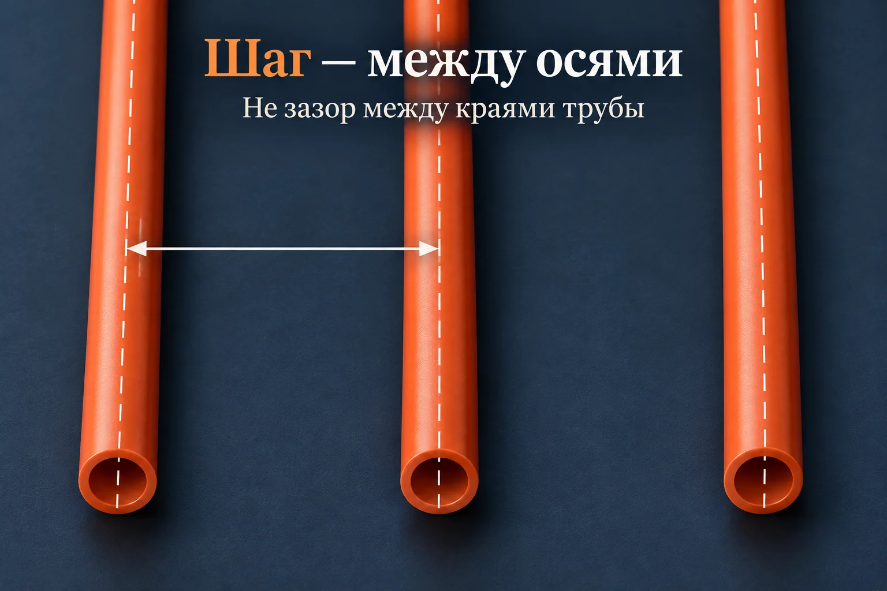
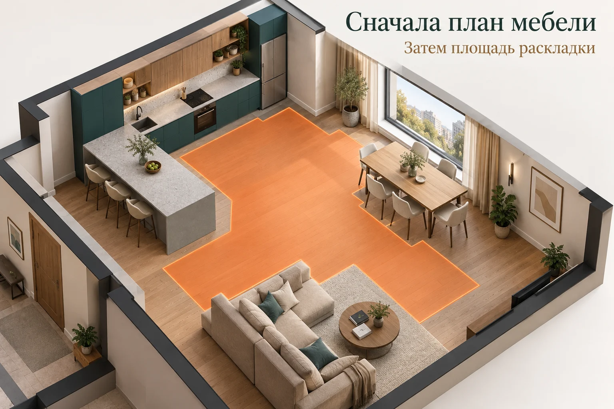

**Шаг 150 мм не является универсальным ответом для любого дома.** Расстояние между трубами выбирают по теплопотерям комнаты, конструкции пола, покрытию и параметрам системы. А вот расход трубы при уже выбранном шаге можно предварительно проверить самостоятельно: площадь раскладки делят на шаг в метрах и отдельно прибавляют подводки.

Путаница начинается, когда эти две задачи смешивают. Один мастер предлагает «везде по сто, чтобы наверняка», другой — «по двести, незачем переплачивать». В смете разница заметная, но сама по себе плотность трубы ещё не объясняет, будет ли тепло. Разберём, что можно проверить рулеткой и калькулятором, а какой ответ нужно получить от проектировщика до покупки материалов.

## Что именно называют шагом трубы

Шаг — расстояние между осями соседних участков трубы, а не свободная щель между ними. На плане это размер между двумя линиями, которыми обозначены трубы. В разговоре 100, 150 и 200 мм часто превращаются в 10, 15 и 20 см: смысл тот же, но для формулы нужны соответственно 0,10, 0,15 и 0,20 метра.

Например, у трубы с наружным диаметром 16 мм при шаге 150 мм свободный промежуток между соседними прямыми участками составляет 134 мм. Это обычное вычитание, а не монтажный допуск. Если отмерять 150 мм именно между краями, фактический шаг окажется 166 мм, и раскладка уже не совпадёт с исходным планом.

*Условная 3D-схема создана с помощью ИИ. Стрелка показывает принцип измерения между осями; изображение не выполнено в масштабе.*

Не следует также путать окончательный шаг с расстоянием между трубами на промежуточном этапе укладки «улитки». В готовой раскладке рядом располагаются участки встречного хода. Проверять нужно законченный рисунок по проекту, а не фотографию, сделанную в середине работы.

## Почему нельзя выбрать расстояние только по названию комнаты

Две спальни одинаковой площади могут требовать разной теплоотдачи. Одна находится между отапливаемыми помещениями, другая — угловая, с большим остеклением. Площадь пола одинакова, а условия нет. Поэтому надпись «для спальни — 200 мм» без исходных данных мало помогает принять решение.

В [ответах VALTEC о водяном тёплом поле](https://valtec.ru/make/warm-floor-faq.html) среди факторов расчёта названы теплопотери, расположение помещения и напольное покрытие. Практический вывод для владельца дома: перед обсуждением шага нужно зафиксировать, какое помещение рассчитывают и чем его будут отделывать. Замена плитки на другое покрытие — повод проверить решение, а не просто поменять название материала в смете.

Отдельный вопрос — роль пола. Он может быть единственным отоплением комнаты или работать вместе с радиатором. Попросите показать, какую часть потребности в тепле должен покрывать именно пол. Без этого фраза «будет достаточно» остаётся обещанием без понятного основания.

Полезно запросить не только итоговую цифру, но и короткое пояснение: какие теплопотери приняты, какая площадь реально обогревается, какое покрытие учтено. Такой разговор не требует от заказчика самостоятельно считать отопление. Он позволяет проверить, что решение относится к его дому, а не перенесено из прошлого проекта.

## Что меняется между 100, 150 и 200 мм

При одинаковой площади уменьшение шага увеличивает длину трубы. В предварительной геометрической оценке переход с 200 на 100 мм удваивает метраж в зоне раскладки. Но из этого не следует удвоение отопительной мощности: метры трубы и тепловой поток — разные величины.

В [материале VALTEC о конструкции пола](https://valtec.ru/document/article/konstrukciya_i_materialy_teplogo_pola.html) рассматриваются разные конструкции и способы распределения тепла. Поэтому сравнивать варианты шага разумно внутри одной принятой системы, сохраняя остальные условия. Нельзя приписывать разницу только шагу, если одновременно изменились покрытие, стяжка или температура воды.

Слово «чаще» не означает автоматически «лучше». Дополнительная труба должна иметь обоснование. И слово «реже» не означает автоматически «экономичнее»: сначала нужно убедиться, что решение выполняет задачу отопления. Правильная экономия начинается после проверки работоспособности, а не вместо неё.

## Сначала площадь раскладки, потом метры трубы

Площадь комнаты из объявления о продаже дома не всегда равна площади, на которой проектом предусмотрена труба. Нужен план с постоянным оборудованием, кухней и согласованными зонами обогрева. Мы не предлагаем автоматически вычитать всю мебель: границы определяют для конкретной системы и планировки.

*ИИ-визуализация принципа планирования. Оранжевая область условна: это не температурная карта и не универсальное правило исключения мебели из обогрева.*

Представим кухню-гостиную площадью 24 м². После согласования планировки в примере для раскладки оставили 18 м². Если по привычке подставить все 24 м² при шаге 150 мм, получится 160 м трубы вместо 120 м до подводок. Разница в 40 м возникнет не из-за запаса и не из-за сложного монтажа, а просто из-за неверного исходного поля.

Сохраните план вместе со сметой. Если кухонный остров переместят, будет понятно, какое исходное условие изменилось. Это гораздо полезнее, чем через месяц пытаться вспомнить, почему мастер считал одну площадь, а магазин — другую.

## Пример для 18 м²: сколько трубы получится

Для предварительного сравнения используем формулу **длина в зоне раскладки ≈ площадь / шаг в метрах**. Она оценивает плотность раскладки, но не строит точную трассу с поворотами. В таблице одна и та же площадь 18 м²; подводки ещё не включены.

| Шаг между осями | Проверка | Предварительная длина |
|---|---|---|
| 100 мм | 18 / 0,10 | 180 м |
| 150 мм | 18 / 0,15 | 120 м |
| 200 мм | 18 / 0,20 | 90 м |

Это сравнение количества материала, не подбор шага для нашей кухни-гостиной. Таблица не отвечает, достаточно ли 200 мм для отопления, и не назначает 100 мм как «надёжный запас». Окончательную длину сверяют по трассам проекта.

Теперь допустим, что в согласованном варианте приняты шаг 150 мм и две петли. Каждая идёт от коллектора к своей зоне и возвращается обратно; для простоты примера каждый такой участок вне зоны раскладки имеет длину 3 м. Получается четыре участка по 3 м, то есть 12 м подводок. Предварительный общий итог — **120 + 12 = 132 м**.

Ошибкой было бы прибавить только 3 м «до коллектора». Не менее неприятная ошибка — добавить 12 м повторно, когда проектировщик уже указал полные длины петель вместе с подводками. Перед вводом числа спросите, что именно оно включает.

Сравнить свои исходные данные можно в [калькуляторе трубы водяного тёплого пола](/kalkulyatory/inzhenernye/vodyanoy-teplyy-pol/). Он помогает проверить метраж и упаковку, но не рассчитывает теплопотери и не выбирает за вас шаг.

## Два контура — не обязательно две одинаковые половины

Из общей длины 132 м арифметически получается среднее 66 м на две петли. Но среднее не доказывает, что в проекте действительно две петли по 66 м. Одна может иметь более длинный подход к коллектору или другую геометрию. Проверяют каждую трассу, а не только результат деления.

В [описании технологии VALTEC](https://valtec.ru/document/article/tehnologiya_montaja_vodyanogo_teplogo_pola.html) шаг и конфигурация привязаны к проекту; отдельно рассматриваются граничные зоны и ограничения петель. Приведённые производителем ориентиры нельзя превращать в единый предельный метраж для любой трубы и любого оборудования. Для своего решения нужны проверенные длины и гидравлические параметры.

Если у окна предложен более частый шаг, попросите обозначить границу этой зоны на плане. Тогда расход можно посчитать по зонам и сложить. Формулировка «возле окна сделаем погуще» без размеров не позволяет ни проверить смету, ни повторить расчёт.

## Почему общего метража недостаточно для покупки бухт

Предположим, в другом проекте нужны три непрерывных отрезка по 70 м. Всего 210 м. Две бухты по 120 м дают 240 м, и кажется, что останется ещё 30 м. Однако из каждой такой бухты можно отрезать только один участок длиной 70 м: оставшиеся 50 м для следующего участка недостаточны.

*ИИ-иллюстрация проверенного арифметического примера: при покупке только бухт по 120 м для трёх непрерывных отрезков по 70 м нужны три бухты. Не рекомендация длины контура.*

Из этих конкретных бухт получится покупка 360 м с остатком 150 м. Другая фасовка может дать иной результат, поэтому до оплаты полезно составить раскрой: какой непрерывный отрезок из какой бухты берут. Самый дешёвый метр по прайсу не обязательно означает самую дешёвую закупку проекта.

Не пытайтесь устранить эту проблему самовольным соединением обрезков внутри пола. Задача закупки — обеспечить предусмотренные проектом непрерывные участки. Решения о соединениях, допустимых узлах и ремонте относятся к документации системы и согласованию со специалистом, а не к округлению в калькуляторе.

## Что должно быть понятно до начала монтажа

Хороший результат подготовки — план, на котором видны площадь раскладки, шаг по зонам, трассы и полные длины петель. К нему привязаны выбранные труба, оборудование и покрытие. По этому набору можно проверить смету и спросить о конкретном расхождении, вместо спора «сто или двести — что лучше».

Конструкцию пола проверяют отдельно: расстояние между трубами не задаёт толщину стяжки. Об этом есть [разбор слоя над трубой и общей высоты пола](/blog/tolshchina-styazhki-pod-teplyy-pol/). Эти решения связаны, но одно не заменяет другое.

Итог простой: **сначала обоснованный шаг и план, затем длины, затем раскрой бухт**. Если пока есть только площадь комнаты, можно оценить варианты расхода. Нельзя по одной площади честно обещать, что выбранный вариант отопит дом.
