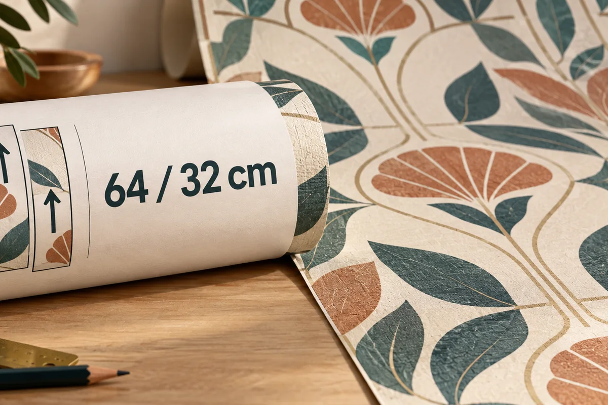
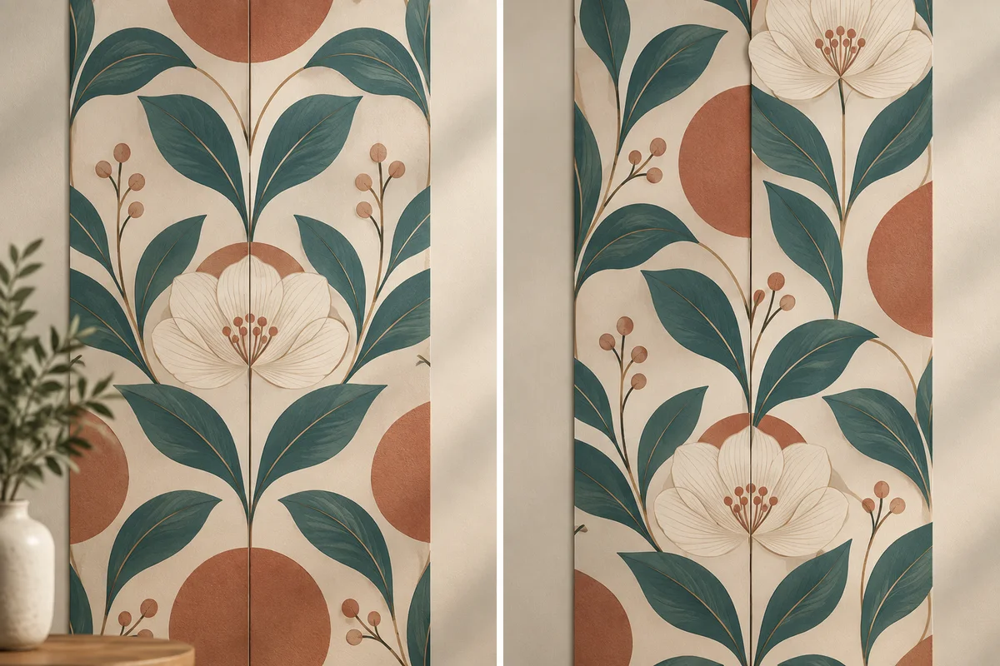
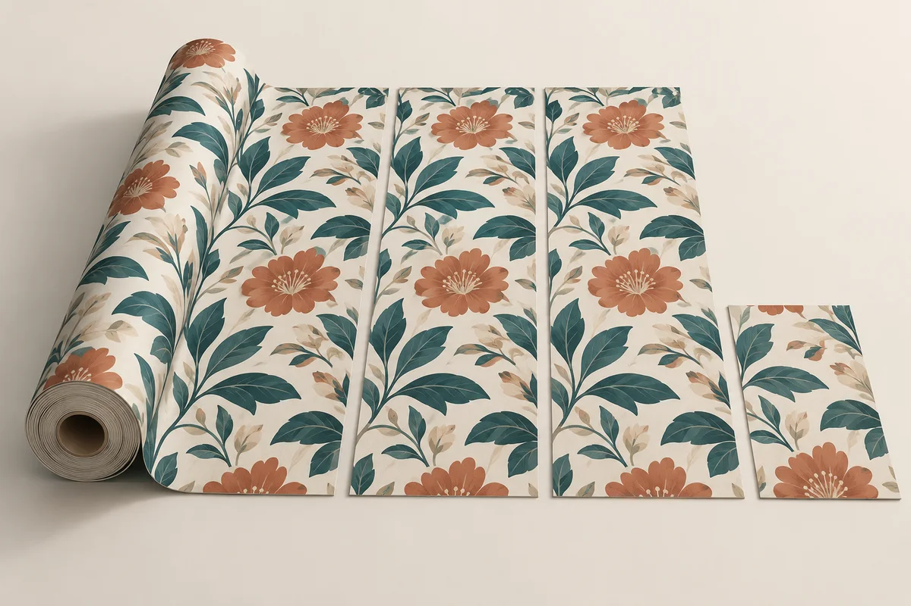
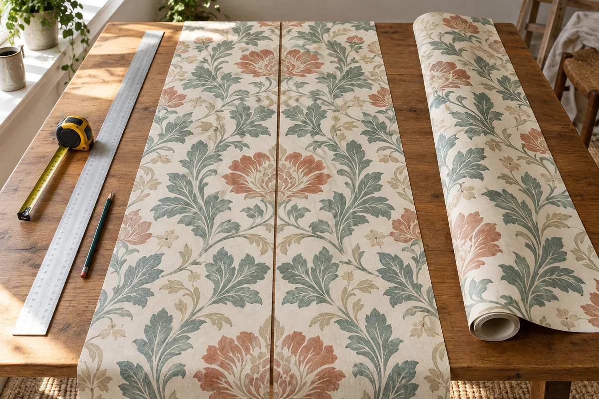

**Раппорт — это высота, через которую рисунок на обоях повторяется полностью.** В маркировке `64/32` первое число означает повтор через 64 см, а второе — сдвиг соседнего полотна на 32 см при смещённой стыковке. Эти 32 см нельзя автоматически прибавлять к длине каждой полосы: сначала нужно понять знак совмещения на этикетке и проверить, как чередуются полотна конкретного артикула.

Именно здесь обычный расчёт «площадь стен разделить на площадь рулона» начинает ошибаться. Стену закрывают не квадратными метрами вообще, а целыми вертикальными полотнами. Короткий остаток рулона может иметь достаточную площадь, но не дотянуться от потолка до пола. Поэтому правильный порядок такой: определить длину полотна, узнать, сколько целых полотен выходит из рулона, и только затем считать покупку.

## Что означают числа 64/32 на этикетке

Узор на рулоне повторяется по вертикали. Если раппорт равен 64 см, одинаковый фрагмент рисунка снова появится через 64 см по длине полотна. Это не ширина цветка и не расстояние между швами, а полный шаг повторения композиции.

Второе число относится к соседней полосе. При маркировке 64/32 рисунок следующего полотна нужно сместить относительно предыдущего на 32 см, чтобы линии и мотивы сошлись на стене. В официальном [каталоге A.S. Création](https://www.as-creation.com/fileadmin/02_Tapeten_Highlights/Kollektionsbroschuren/Pint_Walls_DE-EN.pdf), например, для артикула 387251 указаны рулон 10,05 × 0,53 м и repeat 64/32 cm с пометкой offset match. Это пример чтения маркировки, а не универсальные размеры всех обоев.

*Условная ИИ-иллюстрация маркировки. Перед расчётом используйте данные на вкладыше именно выбранного артикула.*

На этикетке важны не только числа. Рядом должен быть символ способа стыковки. Официальная [памятка A.S. Création](https://www.as-creation.com/en/advice-help/wallpaper-advice/wallpaper-symbols) объясняет: при прямой стыковке одинаковые части рисунка располагают на одной высоте, а при смещённой следующее полотно сдвигают на указанную величину. [Marburg](https://marburg.com/en/wallpaper-consultation/) отдельно выделяет свободное совмещение, когда подгонять рисунок не требуется.

## Свободная, прямая и смещённая стыковка

У однотонных или мелкофактурных обоев может быть свободная стыковка. Полотно нарезают по высоте с припуском, не разыскивая начало следующего мотива. Отход обычно меньше, но всё равно остаются подрезки у потолка и пола.

При прямой стыковке соседние полосы начинают с одинаковой фазы рисунка. Если на первой полосе крупный лист находится у потолка, на второй он должен оказаться на той же высоте. Расчётную длину каждой полосы удобно округлять вверх до целого раппорта.

При смещённой стыковке соседняя полоса начинается с другой фазы. Для 64/32 это половина полного повторения. Нечётные полотна можно совмещать между собой, чётные — между собой, но точный раскрой зависит от того, где рисунок начинается на рулоне и можно ли использовать остаток для следующей стены. Поэтому формула с одной одинаковой длиной всех полос даёт лишь проверку закупки, а не готовую карту реза.

*Современная 3D-иллюстрация принципа: слева мотивы сходятся на одной высоте, справа соседнее полотно сдвинуто. Это не схема конкретной коллекции.*

## Как посчитать длину одного полотна

Сначала измеряют рабочую высоту от линии начала оклейки до нижней линии подрезки. Затем добавляют общий припуск сверху и снизу. Если рисунок свободный, на этом можно остановиться: например, высота 2,70 м плюс 10 см общего припуска дают полотно 2,80 м.

Для прямого раппорта полученную длину округляют вверх до ближайшего полного повторения. Официальная [инструкция A.S. Création](https://www.as-creation.com/rat-hilfe/tapetenberatung/tapeziertipps) описывает ту же логику: длину будущего полотна делят на раппорт, число повторов округляют вверх и снова умножают на длину раппорта.

Для высоты 2,70 м, припуска 0,10 м и раппорта 0,64 м:

**2,80 / 0,64 = 4,375 повтора → округляем до 5 → 5 × 0,64 = 3,20 м.**

Получившиеся 3,20 м — расчётная длина одного полотна для этой проверки. Это не значит, что у потолка обязательно нужно выбросить 40 см: положение первого полотна можно выбрать по рисунку, а остатки иногда подходят над дверью или под окном. Но до построения раскладки считать из рулона четыре полосы по 2,80 м уже нельзя — рисунок не сойдётся.

## Пример: комната с периметром 14 метров

Возьмём комнату без автоматического вычета окон и дверей. Периметр оклеиваемых стен — 14 м, высота — 2,70 м. Выбран рулон шириной 0,53 м и длиной 10,05 м, на подрезку добавляем 10 см, раппорт — 64 см.

Сначала считаем число полотен: **14 / 0,53 = 26,42**, значит понадобится 27 целых полос. Длина одной полосы с прямым совпадением рисунка получилась 3,20 м. Из рулона выходит **целая часть 10,05 / 3,20 = 3 полотна**. Четвёртому не хватит длины, даже если по площади на бумаге остаток кажется большим.

Теперь делим 27 полотен на три: получается **9 рулонов к покупке** без дополнительного резервного рулона. Округление выполняется в самом конце. Если округлять каждый квадратный метр или каждую стену отдельно, закупка может незаметно вырасти.

*Условная 3D-иллюстрация выхода целых полотен. Фактическая длина остатка зависит от размеров артикула и выбранной точки начала рисунка.*

Проверить свои размеры можно в [калькуляторе обоев](/kalkulyatory/otdelka/oboi/). Он считает полотна по периметру, округляет длину по раппорту и отдельно показывает точную потребность и целые рулоны. Запас задаётся явно — процентом или дополнительным закрытым рулоном; скрытой надбавки нет.

## Почему нельзя просто прибавить 32 см к каждой полосе

Такой совет выглядит безопасным, но смешивает две разные вещи. Число 32 в маркировке 64/32 описывает фазовый сдвиг соседней полосы. Оно не говорит, что каждый новый отрезок обязан быть на 32 см длиннее предыдущего. Если без разбора прибавить 32 см ко всем 27 полотнам из примера, в расчёте появится 8,64 м материала, смысл которого не связан с реальным раскроем.

При смещённой стыковке полезнее разложить рядом два-три будущих полотна. Найдите одинаковый мотив, отметьте верх каждой полосы и посмотрите, повторяется ли чередование через две полосы. После этого можно понять, какой остаток продолжает следующую фазу рисунка, а какой годится только для короткого участка.

*ИИ-визуализация рабочего стола. Сначала совмещают мотив соседних полос, затем отмечают линии реза; изображение не задаёт монтажные размеры.*

Для комнаты с проёмами и несколькими стенами используйте [генератор раскладки обоев](/instrumenty/raskladka-oboev/). Он раскладывает отдельные полотна, учитывает прямую или смещённую подгонку и показывает раскрой каждого рулона. Получившийся итог можно перенести в калькулятор и добавить только осознанный резерв.

## Вычитать ли окна и двери

Площадь проёма не равна гарантированной экономии целого рулона. Окно действительно уменьшает оклеиваемую поверхность, но по его сторонам могут остаться два узких простенка, для которых нужны разные участки полноразмерного полотна. При крупном рисунке короткий остаток ещё должен совпасть по фазе с соседней полосой.

В быстром расчёте безопаснее считать непрерывный ряд полотен по полному периметру и не выдавать площадь окна за готовую экономию. В точной раскладке проём задаётся на конкретной стене: тогда видно, можно ли использовать низ одной полосы над окном или перенести остаток на следующую стену. Это и есть разница между предварительным количеством и картой реза.

## Что проверить до оплаты рулонов

Сфотографируйте вкладыш и лицевую этикетку одного рулона. Сверьте артикул, размер рулона, знак стыковки, оба числа раппорта, номер партии и оттенок. [ГОСТ 6810-2002](https://protect.gost.ru/gost/details/0d517194-e3f9-4143-9550-34afcb44a0a4) в официальном реестре Росстандарта охватывает технические требования и маркировку ряда видов обоев, но число рулонов для вашей комнаты стандарт не рассчитывает — исходные данные всё равно берутся с упаковки выбранного изделия.

Если рисунок крупный, сделайте пробную раскладку до нарезки всей партии. Два соседних полотна быстрее обнаружат неверно прочитанную маркировку, чем уже оклеенная стена. Заодно станет ясно, где у рисунка визуальный верх: некоторые мотивы формально совмещаются, но выглядят лучше только в одном направлении.

Сохраните один закрытый рулон, если это осознанно нужно для ремонта или сложных участков, и заранее уточните условия возврата. Не подменяйте это автоматическим процентом «на всякий случай». Крупный раппорт уже создаёт расчётные отходы; второй скрытый запас поверх них может заметно завысить покупку.

## Короткий итог

Маркировка 64/32 читается так: полный рисунок повторяется через 64 см, соседнее полотно при смещённой стыковке сдвигается на 32 см. Сначала определяют длину целого полотна и выход полос из рулона, затем считают рулоны. Для простой стены достаточно калькулятора; для смещённого рисунка, проёмов и использования остатков нужна раскладка.

Главная проверка перед покупкой проста: расчёт должен объяснять не только общую площадь обоев, но и **сколько целых полотен получается из каждого рулона**. Если этого шага нет, красивое число квадратных метров ещё не означает, что материала хватит на стену.
