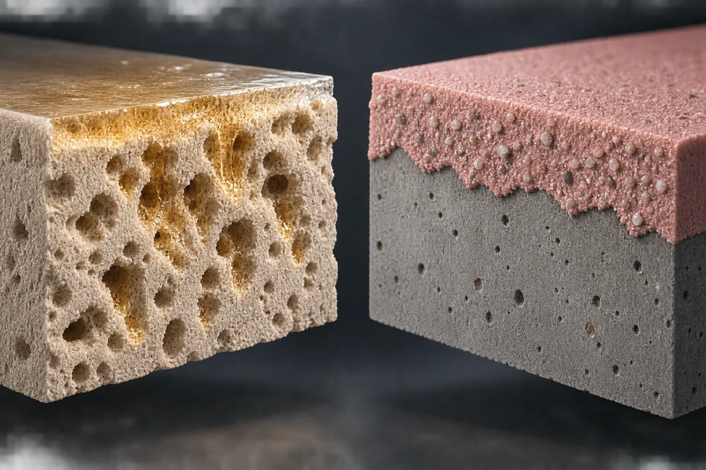
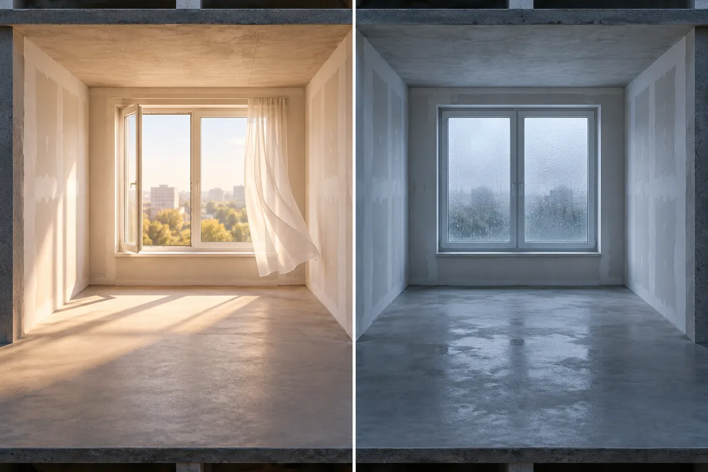
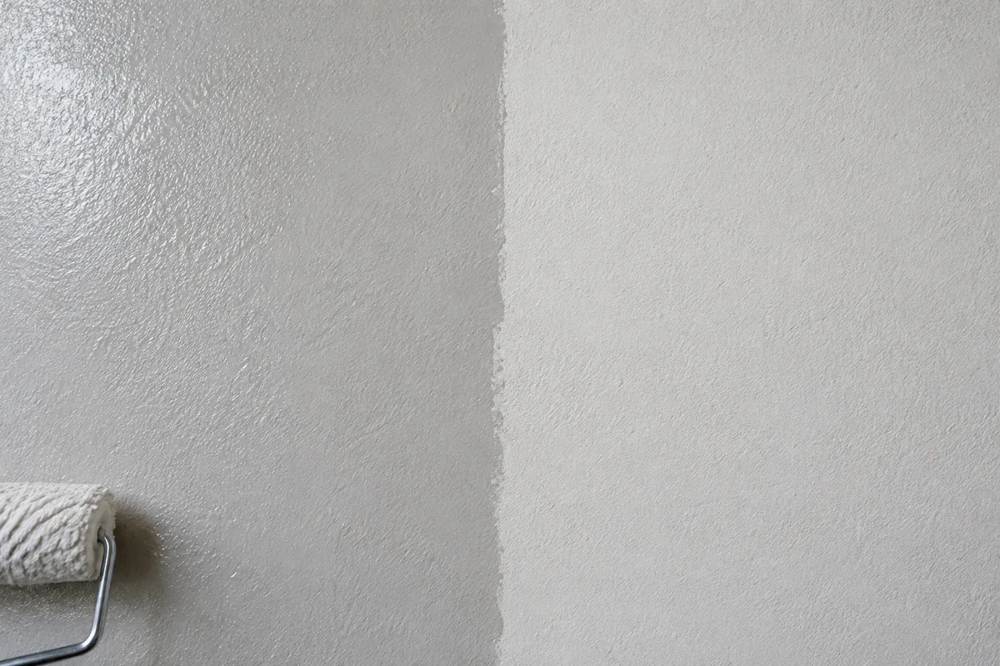
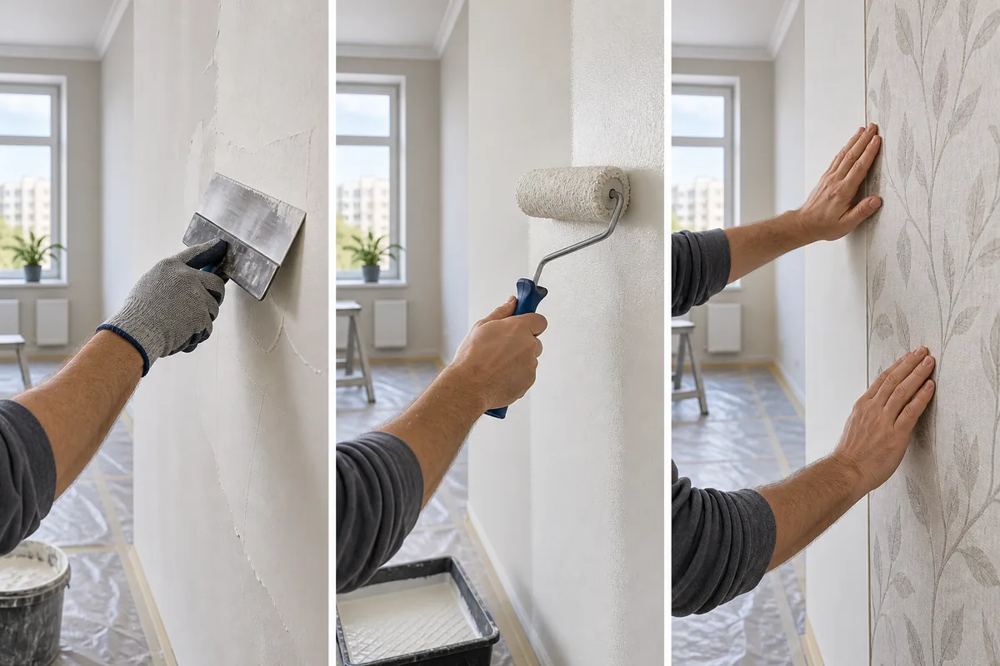

**Грунтовка может сохнуть от пары часов до половины суток и дольше — единого срока для всех составов нет.** Например, производитель указывает для Церезит CT 17 Concentrate 2–4 часа, для КНАУФ-Тифенгрунд — не менее 3 часов, а для адгезионного КНАУФ-Бетогрунда — не менее 12 часов. Правильное число нужно брать с этикетки или из технического листа именно вашей грунтовки, а не из универсальной таблицы в интернете.

Указанное время — это не будильник, после которого стену автоматически можно шпаклевать, красить или оклеивать. Оно относится к определённой температуре, влажности, основанию, толщине слоя и следующей операции. Поэтому разумный порядок такой: найти срок производителя, выдержать его при подходящих условиях, осмотреть всю поверхность и только затем начинать следующий этап.

## Почему одна грунтовка сохнет 2 часа, а другая 12

Под словом «грунтовка» продаются разные по назначению материалы. Глубокопроникающий водно-дисперсионный состав впитывается в поры и после высыхания обычно почти не меняет рельеф. Адгезионная грунтовка для гладкого бетона оставляет шероховатый слой с минеральным наполнителем. У этих продуктов различаются состав, масса нанесённого материала и задача, поэтому сравнивать их только по надписи «грунтовка» бессмысленно.

Это хорошо видно в актуальных данных одного производителя. В [каталоге КНАУФ](https://www.knauf.ru/upload/iblock/178/hwzmpn7ndzqcuvrvjffck33qxs8m2o82/Katalog-SSS-i-GS-KNAUF-A4-_19_02_2026_-v01-Preview.pdf) для Тифенгрунда указано не менее 3 часов, для Мультигрунда и Миттельгрунда — не менее 6, для Бетогрунда — не менее 12 часов. Это не диапазон для свободного выбора: каждое число относится к своему продукту и области применения.

*Современная 3D-иллюстрация принципа: прозрачный глубокопроникающий состав работает с впитывающим основанием, кварцевый адгезионный создаёт шероховатость на гладком. Это не разрез конкретной марки.*

Разброс есть даже внутри одной группы. [Церезит CT 17 Concentrate](https://www.ceresit.ru/ru/products/vnutrennyay-otdelka/primers-for-interior/ct_17_concentrate) высыхает, по данным производителя, за 2–4 часа в зависимости от температуры, влажности воздуха, расхода и впитывающей способности основания. Для [CT 17 PRO](https://www.ceresit.ru/ru/products/tiling/supplementary-materials/ct_17_pro) указано до 2 часов, но там же есть отдельное условие для крепления плитки определёнными клеями на цементных основаниях. Такое исключение нельзя переносить на шпаклёвку, краску или обои.

## Что сильнее всего меняет время сушки

Первый фактор — количество воды, которое должно уйти из слоя. Если валик оставляет лужицы и наплывы, поверхность сохнет неравномерно: сухая на вид середина стены соседствует с влажными углами. Производители обычно требуют наносить грунтовку равномерно и не допускать скоплений. «Пожирнее для надёжности» здесь не означает лучше.

Второй фактор — основание. Пористая сухая штукатурка быстро забирает воду, а плотная поверхность почти не впитывает. Но чрезмерно впитывающее основание тоже не повод считать работу законченной за несколько минут: после высыхания может потребоваться проверка впитываемости и второй слой. [Церезит](https://www.ceresit.ru/ru/products/vnutrennyay-otdelka/primers-for-interior/ct_17_concentrate) прямо связывает срок с впитывающей способностью и рекомендует после высыхания оценить результат обработки.

Третий фактор — воздух в комнате. В технических материалах КНАУФ контрольные сроки приведены для температуры около +20 °C и относительной влажности 50–70%. При более холодном и влажном воздухе испарение идёт медленнее. Закрытая ванная после мокрых работ и сухая проветриваемая комната — это разные условия, даже если грунтовка из одного ведра.

*Условная 3D-сцена показывает влияние микроклимата, а не задаёт новый срок. Если фактические условия выходят за диапазон техкарты, ориентир с упаковки нельзя механически пересчитать.*

Не стоит «ускорять» сушку тепловой пушкой, направленной в одну точку, или сильным сквозняком. Локальный перегрев и слишком быстрый обдув дают разные условия на одной стене. Безопаснее держать температуру и воздухообмен в допустимом для продукта диапазоне и дать поверхности высохнуть равномерно.

## Перед шпаклёвкой

Шпаклёвку наносят после высыхания грунтовочного слоя, если такая последовательность предусмотрена системой материалов. Например, [КНАУФ-Тифенгрунд](https://www.knauf.ru/catalog/sukhie-stroitelnye-smesi-i-gotovye-sostavy/gruntovki/knauf-tifengrund/) предназначен в том числе для подготовки основания под шпаклёвку, а производитель указывает время высыхания 3 часа. Для гладкого бетона перед гипсовыми составами у [КНАУФ-Бетогрунда](https://www.knauf.ru/catalog/sukhie-stroitelnye-smesi-i-gotovye-sostavy/gruntovki/knauf-betogrund/) уже другой ориентир — 12 часов.

Начинать раньше опасно не потому, что часы ещё не «дотикали», а потому, что влажный промежуточный слой может не выполнить свою задачу. Кроме того, толстая штукатурка или шпаклёвка под грунтом сама должна быть высохшей до состояния, которое допускает выбранная система. Грунтовка не превращает влажное основание в готовое.

Если предстоит большой объём, сначала посчитайте расход в [калькуляторе грунтовки](/kalkulyatory/otdelka/gruntovka/): перенесите норму и фасовку с техкарты, задайте число слоёв и получите целые упаковки. Для последующей закупки смеси есть отдельный [калькулятор шпаклёвки](/kalkulyatory/otdelka/shpaklevka/). Эти расчёты не проверяют совместимость двух конкретных продуктов — её всё равно нужно подтвердить по документации системы.

## Перед покраской

Под краской особенно заметны неодинаково впитывающие участки. Если один фрагмент стены уже матовый, а другой ещё темнее или блестит, спешить с валиком не стоит. Важно осмотреть не только центр стены, но и углы, зоны у пола, места локального ремонта и участки, где грунтовка могла лечь толще.

*Макро-ИИ-визуализация для сравнения при одинаковом освещении. Блеск и цвет помогают заметить неоднородность, но не заменяют срок и условия из технического листа.*

Цвет сам по себе ненадёжен: пигментированная грунтовка может оставаться цветной после высыхания, а прозрачная — почти исчезнуть визуально. «Не липнет к пальцу» тоже не универсальный критерий. Чистый палец способен проверить только поверхность в одной точке и заодно оставить загрязнение. Решение принимают по совокупности признаков: выдержан срок производителя, соблюдены условия, нет влажного блеска и холодных сырых зон, слой равномерен.

Количество краски рассчитывают отдельно по укрывистости и числу слоёв выбранного покрытия. [Калькулятор краски](/kalkulyatory/otdelka/kraska/) не должен автоматически вычитать грунтовку из расхода краски: это разные продукты с разными паспортными нормами.

## Перед обоями

Клеить обои на ещё влажную грунтовку особенно рискованно: за полотном испарение меняется, а состояние основания уже трудно контролировать. В фирменной [инструкции КНАУФ по подготовке стен под обои](https://www.knauf.ru/service/blog/instrukcija-podgotovka-sten-pod-oboi/) следующий шаг начинается после полного высыхания Тифенгрунда. Это точнее, чем бытовое правило «подождать часок».

Сама стена тоже должна быть подготовлена под выбранный вид обоев. Тонкое полотно не скрывает риски, царапины и пятна, а грунтовка не исправляет геометрию и качество шпаклевания. После шлифования нужно убрать пыль, нанести предусмотренный состав без луж и дождаться полного высыхания.

*ИИ-иллюстрация трёх следующих операций. Она показывает выбор этапа, но не утверждает, что один продукт подходит под все три покрытия.*

## Практический пример: можно ли начинать в 13:00

Представим обычную комнату: сухая оштукатуренная стена очищена от пыли, выбрана КНАУФ-Тифенгрунд, в помещении около +20 °C и влажность находится в указанном производителем диапазоне 50–70%. Грунтование закончили в 10:00. В информационном листе для каждого слоя приведено не менее 3 часов.

Значит, 13:00 — не гарантированное время начала шпаклевания, а первая допустимая точка проверки. Сначала осматривают всю стену, включая углы и места, где валик разворачивали чаще. Если поверхность равномерна и полностью высохла, условия не менялись, а следующая операция разрешена системой, можно продолжать. Если участок темнее, блестит или ощущается явно влажным, ждут дольше и устраняют причину, а не перекрывают его шпаклёвкой.

Если в комнате прохладнее, влажнее или слой получился неравномерным, арифметика «10:00 + 3 часа» уже не доказывает готовность. Техкарта не даёт универсальной формулы пересчёта каждой дополнительной единицы влажности в минуты. Поэтому нельзя честно обещать новое точное время без измерений и указаний производителя.

Срок удобно перенести в [таймер высыхания](/instrumenty/tajmer-skhvatyvaniya/?preset=primer-deep&amp;from=article-primer-drying). Он напомнит, когда пора вернуться к стене, но запускать его нужно по фактическому времени окончания работ, а после сигнала — всё равно проверить поверхность.

## Как понять, что можно продолжать

Сначала сверяют банку и технический лист: название продукта, основание, допустимую температуру, влажность, число слоёв, разбавление и следующую операцию. Затем убеждаются, что прошёл минимальный срок при подходящих условиях. После этого осматривают всю плоскость при боковом свете: не должно быть влажных блестящих зон, луж и явно неодинаковых участков.

Если производитель требует проверку впитываемости, её выполняют именно по его инструкции. Второй слой наносят только тогда, когда он предусмотрен и первый полностью высох. Не нужно добавлять ещё один слой «на всякий случай»: лишний материал способен ухудшить результат так же, как недостаток.

Общие правила производства отделочных работ задаёт действующий [СП 71.13330.2017](https://protect.gost.ru/sp/details/ca915ed9-5bce-4de4-94af-debfd041a939), но конкретные часы сушки, совместимость и порядок слоёв определяет документация продукта. Свод правил не превращает разные грунтовки в одну технологию.

## Короткий итог

Не выбирайте между советами «два часа» и «оставить на ночь» вслепую. Найдите точный продукт и следующую операцию, возьмите минимальное время из его техкарты, проверьте условия в комнате и состояние всей поверхности. Для глубокопроникающей грунтовки это может быть около 2–4 часов, для некоторых универсальных составов — 6 часов, для кварцевой адгезионной — 12 часов, но каждое число действительно только в границах конкретной системы.

Хороший ориентир звучит не «грунтовка всегда сохнет три часа», а так: **раньше указанного производителем срока не начинаем, а после его окончания проверяем, что слой действительно высох и подходит под следующий материал**.
