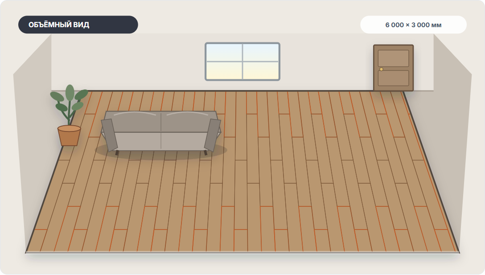

Комната — 18 м², в коробке — 2,2 м² ламината. Кажется, осталось разделить одно на другое. Но результат 8,18 упаковки ещё не отвечает на вопрос, сколько покупать: сначала нужно понять, что именно мы посчитали.

Мы представляем проект строительных калькуляторов «Мастерок». Ниже — разбор без обещания сэкономить определённый процент. Арифметический пример можно проверить на обычном калькуляторе; иллюстрации сделаны в нашем инструменте.

## Первая проверка: хватит ли площади в коробках

Возьмём условную фасовку 2,2 м². Это учебное число, а не характеристика коллекции на иллюстрациях.

- Восемь коробок: 8 × 2,2 = **17,6 м²**. Уже меньше площади пола.
- Девять коробок: 9 × 2,2 = **19,8 м²**. По общей площади больше, чем нужно закрыть.

Значит, если продаются только целые коробки, меньше девяти в таком примере брать нельзя. Но фраза «девяти точно хватит» из этого расчёта не следует: мы ещё не учли раскрой, допустимое использование обрезков, повреждения и согласованный резерв.

Разность 19,8 − 18 = **1,8 м²** — превышение закупленной площади над площадью пола. Это не автоматически свободный запас после укладки. Часть материала может уйти в подрезку, а часть остаться в деталях, которые не подходят для нужного места.

## Почему одинаковые 18 м² дают разные схемы

Представьте прямоугольную комнату 6×3 м. Её площадь не изменится, если повернуть направление досок на 90°. Но изменятся длина ряда, число рядов, положение торцевых стыков и подрезки у границ.

На наших иллюстрациях в обоих вариантах заданы комната 6000×3000 мм, доска 1285×192 мм и палуба со смещением 1/3. Меняется только направление длинной стороны доски. Это визуальная модель, а не фотография ремонта и не готовая монтажная карта.

*На обложке доски направлены вдоль шестиметровой стороны, здесь — перпендикулярно ей. Площадь одинакова, расположение стыков различается. По этим картинкам нельзя определить универсально более выгодный вариант.*

Удобно сравнить, как рисунок выглядит от входа, где окажется крайний ряд и какие подрезки будут заметны. Но каждый нарисованный фрагмент не обязательно означает отдельную новую доску: подходящий отрезок иногда можно использовать в другом месте. И наоборот, совпадения площади обрезка недостаточно — важны его размеры, ориентация и сохранённые соединения.

Для монтажа нужно свериться с инструкцией конкретного покрытия. Например, [Quick-Step отдельно описывает подготовку основания, проверку крайних рядов и расположение стыков](https://int.quick-step.com/en/laminate/installation). Требования одного производителя не стоит превращать в универсальную норму для любого ламината.

## Вторая проверка: округляем уже уточнённую потребность

Пусть после проверки схемы и согласования допущений получилась потребность `N` м². Если фасовка — `P` м², количество коробок равно **N ÷ P с округлением вверх до целого**.

Важно: здесь `N` — не обязательно чистая площадь комнаты. Если в неё уже включены потери и резерв, второй раз прибавлять тот же запас не нужно.

Три условных примера для упаковки 2,2 м²:

| Потребность, которую округляем | Коробки | Всего в коробках | Превышение над этой потребностью |
|---|---:|---:|---:|
| 18,00 м² — только чистая площадь, укладка ещё не учтена | 9 | 19,80 м² | 1,80 м² |
| 19,80 м² — условная уже уточнённая потребность | 9 | 19,80 м² | 0 м² |
| 19,81 м² — другая условная потребность | 10 | 22,00 м² | 2,19 м² |

Последние две строки показывают границу округления, а не рекомендуемый расход для комнаты на картинке. Разница всего 0,01 м² переводит заказ через границу целой коробки. Поэтому промежуточное число нельзя округлять вниз «для удобства», а площадь упаковки лучше брать с этикетки, не из памяти.

## Что записать перед заказом

Чтобы мастер или продавец мог проверить расчёт, передайте не одну итоговую цифру, а короткий набор исходных данных:

1. Размеры и форму каждого участка пола; дверные проёмы, выступы и другие особенности отметьте на обмерном плане.
2. Точный артикул и размеры доски, а также фактическое число досок или площадь в упаковке.
3. Выбранную схему и направление укладки.
4. Какие потери и резерв уже учтены и по какой причине.
5. Потребность до упаковочного округления, количество коробок и площадь материала в них.

Отдельно уточните, нужен ли запас для будущей замены. Не смешивайте его молча с технологическими потерями. Ни визуализация, ни правильное округление коробок не подтверждают готовность основания к монтажу.

## Как повторить сравнение

В [раскладке ламината «Мастерка»](https://getmasterok.ru/instrumenty/raskladka-laminata/) откройте «Параметры», задайте размеры комнаты и доски, затем в шаге «Схема» переключите направление. Для сравнения с иллюстрациями используйте значения 6000×3000 мм и 1285×192 мм, палубу 1/3 и объёмный вид.

Не переносите фасовку 2,2 м² из учебного примера в реальный заказ. Посмотрите этикетку своей коллекции. Если продолжаете расчёт в другом калькуляторе, проверьте, какие значения передались, какая методика применяется и не добавляется ли запас повторно.

Главное правило подготовки покупки: **площадь → потребность под выбранную укладку → целые упаковки**. Эти три числа могут отличаться, и полезный расчёт объясняет каждое из них.
