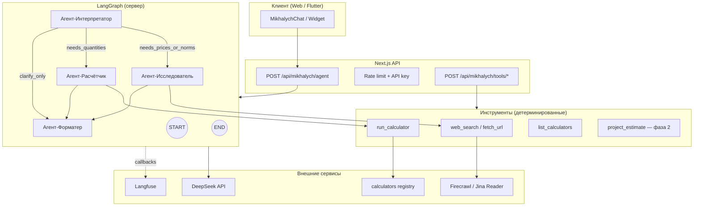

# Михалыч 2.0: мультиагентная архитектура

Документ описывает целевую архитектуру автономного агента поверх существующего прокси DeepSeek (`/api/mikhalych`) и домена калькуляторов `src/lib/calculators/`.

## Текущее состояние (as-is)

| Компонент | Реализация |
|-----------|------------|
| LLM | `deepseek-v4-pro` через OpenAI-совместимый API |
| Оркестрация | Линейный чат: клиент → `POST /api/mikhalych` → upstream |
| Контекст расчёта | Текстовый блок `buildMikhalychCalcContext()` в system/user |
| Математика | **Не вызывается** — модель «советует зайти в калькулятор» |
| Веб | Нет — модель ограничена промптом «не выдумывай цены» |
| Observability | Только server logs |

**Источник истины для расчётов:** `getCalculateFn(slug)` + `CalculatorDefinition` в `src/lib/calculators/`.

---

## Целевая архитектура (to-be)



### Поток данных (типовой запрос)

1. **Пользователь:** «На ванную 6 м² со стенами 2,7 м — сколько плитки и клея, и что сейчас стоит Kerama Marazzi?»
2. **Интерпретатор:** классифицирует намерение → `calculator` + `web_research`; извлекает сущности (площадь, высота, бренд).
3. **Расчётчик:** `run_calculator({ slug: "plitka", values: {...} })` → JSON с материалами, запасом, к покупке.
4. **Исследователь:** `web_search("цена Kerama Marazzi плитка 2026")` → ссылки → `fetch_url` → Markdown для цитирования.
5. **Форматер:** собирает ответ в тоне Михалыча; **цифры только из tool results**; цены — с пометкой «по данным из …, дата».

---

## Оценка инструментов из списка

### LangGraph — **ядро оркестрации (рекомендуется)**

| Критерий | Оценка |
|----------|--------|
| Стек | Официальный **LangGraph.js** — тот же TypeScript, что и Next.js |
| Мультиагент | `StateGraph`, conditional edges, циклы tool-calling, checkpointing |
| DeepSeek | Через `@langchain/openai` `ChatOpenAI` с `baseURL: https://api.deepseek.com` |
| Альтернатива | Python LangGraph зрелее в примерах, но дублирует калькуляторы (Dart/TS parity) |

**Вердикт:** LangGraph.js в `src/lib/mikhalych/agent/` или отдельном worker; граф компилируется на сервере, клиент только стримит SSE.

### Instructor — **не в hot path для web**

| Критерий | Оценка |
|----------|--------|
| Назначение | Строгий structured output (Pydantic) из ответа LLM |
| Стек | Python-first; в TS экосистеме дублируется **Zod + `bindTools` / `withStructuredOutput`** |
| Польза | Имеет смысл в **офлайн-пайплайнах** (парсинг нормативов, батч-импорт) |

**Вердикт:** для Михалыча в Next.js — **Zod-схемы** на границах tool I/O и отдельный узел «валидатор»; Instructor — опционально в Python-сервисе краулинга.

### Langfuse — **обязательная observability**

| Критерий | Оценка |
|----------|--------|
| Интеграция | `@langfuse/langchain` `CallbackHandler` в `graph.invoke/stream({ callbacks })` |
| Что видим | Trace → spans по узлам графа, LLM tokens, tool input/output |
| Стоимость | Теги `user_id`, `session_id`, `model`, `tool_name` для отчётов |
| Self-host | Возможен на Timeweb/VPS рядом с приложением |

**Вердикт:** включить с первого PoC; `flushAsync()` после serverless-запроса.

### Парсинг веба

| Инструмент | Сильные стороны | Слабые | Роль для Михалыча |
|------------|-----------------|--------|-------------------|
| **Firecrawl** | API, Markdown, scrape/search, стабильный прод | Платный, внешняя зависимость | **Продакшен:** `fetch_url`, опционально `search` |
| **Jina Reader** | `r.jina.ai/{url}` → чистый MD, минимум кода | Меньше контроля, лимиты | **PoC / fallback** |
| **Crawl4AI** | Open-source, LLM-friendly MD, self-host | Python, инфра на VPS | **Self-hosted** альтернатива Firecrawl |
| **Crawlee** | Масштабный краулинг, очереди, Playwright | Тяжёлый, не для sync tool call | Только офлайн-индексация нормативов |
| **Playwright** | JS-сайты, сложная авторизация | Дорого в serverless, медленно | Редкий fallback-воркер |
| **Scrapegraph AI** | NL-запросы к странице | Непредсказуемо, дорого, риск галлюцинаций | **Не рекомендуется** для цен/норм |

**Рекомендуемая связка:**

1. **Поиск:** Serper / Tavily / Brave Search API (не в списке, но стандарт для агентов) → URL.
2. **Извлечение:** Firecrawl `scrape` (prod) или Jina Reader (PoC).
3. **RAG (фаза 2):** Crawlee + Crawl4AI офлайн → векторное хранилище (СНиП/ГОСТ, справочники сайта).

### Что не брать в синхронный путь агента

- Crawlee, Playwright — в **фоновые jobs**.
- Scrapegraph — для ad-hoc исследований, не для сметы.

---

## Граф агентов (детализация)

### Состояние графа (`MikhalychState`)

```typescript
{
  messages: BaseMessage[];           // история
  intent: "chat" | "calculate" | "research" | "mixed";
  entities: { area?, slug?, brand?, ... };
  calculatorResults: CalculatorToolResult[];
  researchSnippets: { url, title, excerpt }[];
  flags: { needsClarification?: boolean };
}
```

### Узлы

| Узел | Модель | temperature | Задача |
|------|--------|-------------|--------|
| **interpreter** | deepseek-v4-pro | 0.3 | Классификация, извлечение параметров, выбор slug |
| **researcher** | deepseek-v4-pro | 0.2 | План поиска, вызов web tools, суммаризация с цитатами |
| **calculator** | deepseek-v4-flash | 0 | Только tool calls, без «придуманной» математики |
| **formatter** | deepseek-v4-pro | 0.85 | Персона Михалыча, финальный Markdown |

### Рёбра (conditional)

```
START → interpreter
interpreter → researcher | calculator | formatter | interpreter (уточнение)
researcher → calculator | formatter
calculator → formatter | researcher (если не хватает цен)
formatter → END
```

При **контексте калькулятора** с клиента (`[Контекст расчёта]`) — пропускать повторный `run_calculator`, если хэш контекста совпадает.

---

## Структура Tools (Function Calling)

### 1. `list_calculators`

Поиск slug по ключевым словам (уже есть meta в `scripts/generate-calculators-meta.ts`).

```json
{ "query": "штукатурка стена" }
→ { "matches": [{ "slug": "shtukaturka", "title": "..." }] }
```

### 2. `get_calculator_schema`

Поля, дефолты, единицы — для заполнения `values` без галлюцинаций.

```json
{ "slug": "plitka" }
→ { "fields": [{ "key": "area", "label": "Площадь", "unit": "м²", "defaultValue": 10 }] }
```

### 3. `run_calculator` (критический)

```json
{
  "slug": "plitka",
  "values": { "area": 6, "wallHeight": 2.7, "reservePercent": 10 },
  "scenarioId": "bathroom"
}
```

**Ответ (сжатый, но полный):**

```json
{
  "slug": "plitka",
  "materials": [{ "name": "...", "quantity": 1.2, "withReserve": 1.32, "purchaseQty": 2, "unit": "м²" }],
  "totals": { "totalArea": 16.2 },
  "warnings": [],
  "source": "masterok-calculator-v1"
}
```

Реализация: обёртка над `getCalculateFn(slug)` + `CalculatorDefinition.fields` — **тот же код, что UI**.

### 4. `web_search`

```json
{ "query": "СП 29.13330 гидроизоляция ванная", "locale": "ru", "maxResults": 5 }
```

### 5. `fetch_url`

```json
{ "url": "https://...", "purpose": "extract_prices" }
→ { "markdown": "...", "title": "...", "fetchedAt": "ISO" }
```

### 6. (Фаза 2) `add_to_project_estimate`

Интеграция с `ProjectEstimate*` / procurement — отдельный эпик.

---

## Langfuse + DeepSeek

```typescript
import { CallbackHandler } from "@langfuse/langchain";

const langfuseHandler = new CallbackHandler({
  sessionId: threadId,
  userId: userId,
  tags: ["mikhalych", "production"],
});

await graph.invoke(
  { messages: [...] },
  {
    callbacks: [langfuseHandler],
    configurable: { thread_id: threadId },
    runName: "mikhalych-agent",
  },
);
await langfuseHandler.flushAsync();
```

Дополнительно:

- Кастомные scores в Langfuse: `hallucination_risk` (форматер упомянул цифру без tool result).
- OpenTelemetry (`@langfuse/otel`) — если позже появятся non-LangChain вызовы.

Переменные окружения:

```
LANGFUSE_PUBLIC_KEY=
LANGFUSE_SECRET_KEY=
LANGFUSE_BASE_URL=https://cloud.langfuse.com  # или self-host
LANGFUSE_ENABLED=true
```

---

## Пошаговый план реализации

### Фаза 0 — PoC (1–2 недели)

- [ ] Пакет `packages/mikhalych-agent-poc` — граф + 2 tools (см. README пакета).
- [ ] Langfuse на dev-проекте.
- [ ] Ручной прогон 10 эталонных вопросов (расчёт / цены / совет).

### Фаза 1 — MVP в проде (2–4 недели)

- [ ] `POST /api/mikhalych/agent` со streaming SSE.
- [ ] Server-only tools: `run_calculator`, `list_calculators`, `get_calculator_schema`.
- [ ] Jina Reader или Firecrawl для `fetch_url`.
- [ ] Serper/Tavily для `web_search`.
- [ ] Feature flag `MIKHALYCH_AGENT_ENABLED`.
- [ ] Fallback на старый линейный чат.

### Фаза 2 — Качество и RAG (4–8 недель)

- [ ] Офлайн-индекс нормативов (Crawl4AI + vector DB).
- [ ] Кэш веб-страниц (Redis, TTL 24h для цен).
- [ ] Связка с проектами/сметой.
- [ ] Eval-набор в Langfuse + регрессия на parity-тестах калькуляторов.

### Фаза 3 — Mobile parity

- [ ] Тот же API-контракт для Flutter.
- [ ] Не дублировать граф на клиенте.

---

## Риски

| Риск | Митигация |
|------|-----------|
| LLM всё равно «додумывает» цифры | Formatter prompt + post-check: цифры только из `calculatorResults` |
| Дорогой веб-краулинг | Rate limit, кэш, лимит `maxResults` |
| Расхождение с Flutter | Tools бьют в тот же TS core; parity-тесты |
| Serverless timeout | Лимит итераций графа (max 8 tool calls) |
| Устаревшие СНиПы в вебе | Пометка «проверьте актуальность», приоритет локального RAG |

---

## Связанные файлы

- **Деплой Timeweb:** `docs/mikhalych-timeweb-deploy.md`
- Агент (prod): `src/lib/mikhalych/agent/`
- PoC (эксперимент): `packages/mikhalych-agent-poc/`
- API: `src/app/api/mikhalych/route.ts`, `src/app/api/mikhalych/agent/route.ts`
- Калькуляторы: `src/lib/calculators/registry.ts`
